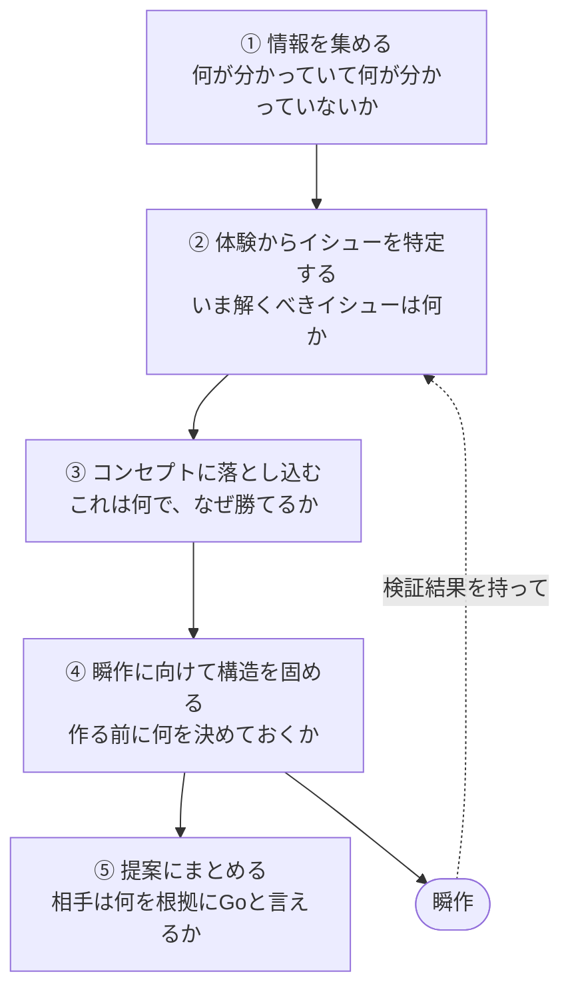

# Prhythm

**プロダクトの構想・提案・立ち上げを、反復的・多角的に検討するためのエージェントスキル集。**
[Agent Skills](https://agentskills.io) オープンスタンダード準拠。

```bash
gh skill install shunsaku-studio/Prhythm
```

📚 **[ドキュメントサイト](https://shunsaku-studio.github.io/Prhythm/)** — スキルカタログと使い方ガイド

---

## What — Prhythm は何か

瞬作（高速プロトタイピング）が最も威力を発揮するのは、プロダクトの構想・提案・立ち上げのフェーズ。Prhythm はこのフェーズで使うスキル集で、次の 3 つを提供する。

1. **プロダクトを反復的・多角的に検討するためのスキル群** — ヒアリング整理から提案デッキまで
2. **効果的な瞬作のためのスキルの使い方ガイド** — どの場面でどれを使うか
3. **はじめての人が提案にトライするためのヒント** — 構想・提案未経験でも入れる導線

各スキルは **単独でも便利、連携するともっと便利** に設計されている。前日のヒアリング準備 30 分だけの利用から、構想フェーズをフルに走る利用まで。

## Why — なぜ作るのか

瞬作で「動くもの」は速く作れるようになった。しかし速さを求めれば求めるほど、プロダクトづくりの主導権は AI に握られ、人間は疎外される。

Prhythm はただ速くつくるためにあるのではなく、人間のプロダクトクリエイターがプロダクトに関する多角的な検討の仕方を学習するためにある。

だから、あえてやらないことを決めている。

- 「人間がなにもわかっていなくてもいい感じになる」ようにはしない — プロダクト像の分かれ目では、**スキルがユーザーに判断を要求する**
- 「動くものができたら満足」としない — 作る前・作った後の検討にこそ型を提供する
- 手っ取り早くできることを売りにしない — 売りは速さではなく**解像度**。速く作れるからこそ、検討に時間を使える

もうひとつの狙いは **職能横断の対話の誘発**。各スキルはビジネス・デザイン・テック・実行計画のいずれかの視点を注入し、その出力は他職種との会話の起点になるよう設計されている。使うほどプロダクトづくりが上手くなる、学習装置としてのスキル集。

## Who — 誰のためか

コアペルソナは **構想・提案が未経験のエンジニア**。


|     | Before    | After                      |
| --- | --------- | -------------------------- |
| 構想  | 未経験       | デザイナーやコンサルと対等に構想に参加する語彙がある |
| 提案  | 未経験       | 提案活動に積極的に参加している            |
| 実装  | 動くもの作りたがり | 作る前の検討を、開発の目線を踏まえてリードできる   |


デザイナー・コンサル・意思決定者は、スキル出力の **対話相手** として設計に組み込まれている。

## How — 5 つのシーンで使う

Prhythm のスキルは、仕事の中の 5 つの瞬間（シーン束）に束ねられている。各束は答えるべき問いを 1 つ持つ。典型ルートはデモと同じく **体験からイシューを特定し、コンセプトに落とし込む**。



各シーンの **core** スキルを紹介すると次のようになる。utility を含む一覧は [シーン別スキル集](https://shunsaku-studio.github.io/Prhythm/guide/scenes/) を参照。

### ① 情報を集める

| スキル | 説明 |
|--------|------|
| [hearing](skills/hearing/) | 顧客ヒアリング支援。mode:prep（進行カード・質問選定）と mode:analysis（ボトルネック仮説・擦り合わせ質問） |
| [market-landscape](skills/market-landscape/) | サービス調査→軸抽出→4象限マップ。空白の右上（望ましい未開拓地帯）を見つける |

### ② 体験からイシューを特定する

| スキル | 説明 |
|--------|------|
| [defining-personas-and-segments](skills/defining-personas-and-segments/) | ターゲット・ペルソナ・セグメントを比較表で整理。Primary は人間が決める |
| [create-journey-map](skills/create-journey-map/) | 台本形式のジャーニーマップ。As-Is（課題→インサイト→HMW）と To-Be（対比→コアシーン候補） |
| [function-usecase-map](skills/function-usecase-map/) | Actor がどの機能を通じて何を達成するかを図にする |

### ③ コンセプトに落とし込む

| スキル | 説明 |
|--------|------|
| [product-vision-and-concept](skills/product-vision-and-concept/) | 体験のインサイトを一行コンセプト + Why/Who/What/差別化に言語化 |

### ④ 瞬作に向けて構造を固める

| スキル | 説明 |
|--------|------|
| [ooui-graphql-modeling](skills/ooui-graphql-modeling/) | プロト段階の GraphQL SDL 設計（ドメイン中心・段階的ゲート） |
| [uncertainty-map](skills/uncertainty-map/) | 仮説を **コア/周辺 × 検証済/未検証** の 2x2 でマッピング。瞬作から②へ戻るループの実体 |
| [proto-storyboard](skills/proto-storyboard/) | To-Be を提案当日約5分のデモプレイ絵コンテ（画面 / 操作 / 台本）に落とす |

### ⑤ 提案にまとめる

| スキル | 説明 |
|--------|------|
| [uncertainty-map](skills/uncertainty-map/) | 2x2 マップそのものが共有物。「何が未検証で、次に何を検証するか」が Go の根拠になる |
| [proto-storyboard](skills/proto-storyboard/) | 顧客が社内で再現できるデモ台本。瞬作の力の入れどころが決まる |
| [delivery-team-plan](skills/delivery-team-plan/) | 提案後の体制（Owner / 実行レーン / Support）と RACI |
| [delivery-phase-plan](skills/delivery-phase-plan/) | 役割別矢羽。フェーズ・ゲート・Go/No-Go 判定 |

各スキルの frontmatter に `rank`（`meta` / `core` / `utility`）と `categories`（`business` / `design` / `tech` / `delivery`、1〜2）を持つ。

## Install

```bash
gh skill install shunsaku-studio/Prhythm
```

Claude Code のプラグインとして:

```bash
/plugin marketplace add shunsaku-studio/Prhythm
/plugin install prhythm@shunsaku-studio/Prhythm
```

## License

MIT