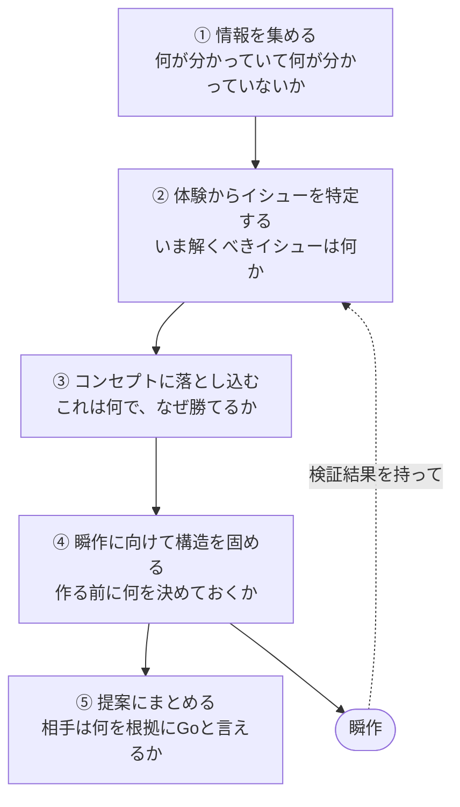

# シーン別スキル集

Prhythm のスキルは、仕事の中の **5 つの瞬間（シーン束）** に束ねられている。各束は答えるべき問いを 1 つ持つ。全部を順番どおりに走らせる必要はないが、典型ルートは **体験からイシューを特定し、コンセプトに落とし込む**（デモの 01→08 と同じ向き）。

## シーンの定義

| シーン | 答える問い |
|--------|------------|
| ① 情報を集める | 何が分かっていて、何が分かっていないか |
| ② 体験からイシューを特定する | いま解くべきイシューは何か。誰の、どの瞬間に現れるか |
| ③ コンセプトに落とし込む | これは何で、なぜ勝てるか |
| ④ 瞬作に向けて構造を固める | 作る前に何を決めておくか |
| ⑤ 提案にまとめる | 相手は何を根拠に Go と言えるか |

**core** は次の検討の入力になる成果物を出すスキル。**utility** は場面に応じた補助。下表はシーンに紐づく両方を載せる。**meta** はこのページの対象外。

## ① 情報を集める

| スキル | ランク | 説明 |
|--------|--------|------|
| [hearing](/skills/hearing/) | core | 顧客ヒアリング支援。mode:prep（進行カード・質問選定）と mode:analysis（ボトルネック仮説・擦り合わせ質問） |
| [market-landscape](/skills/market-landscape/) | core | サービス調査→軸抽出→4象限マップ。空白の右上（望ましい未開拓地帯）を見つける |

## ② 体験からイシューを特定する

| スキル | ランク | 説明 |
|--------|--------|------|
| [defining-personas-and-segments](/skills/defining-personas-and-segments/) | core | ターゲット・ペルソナ・セグメントを比較表で整理。Primary は人間が決める |
| [create-journey-map](/skills/create-journey-map/) | core | 台本形式のジャーニーマップ。As-Is（課題→インサイト→HMW）と To-Be（対比→コアシーン候補） |
| [function-usecase-map](/skills/function-usecase-map/) | core | Actor がどの機能を通じて何を達成するかを図にする |

## ③ コンセプトに落とし込む

| スキル | ランク | 説明 |
|--------|--------|------|
| [product-vision-and-concept](/skills/product-vision-and-concept/) | core | 体験のインサイトを一行コンセプト + Why/Who/What/差別化に言語化 |
| [assumption-breaker](/skills/assumption-breaker/) | utility | RFC・提案の暗黙前提を抽出し、それぞれを外して別解の空間を広げる |
| [feature-backlog-map](/skills/feature-backlog-map/) | utility | コンセプトから機能一覧・バックログ・受入基準を起こす |

## ④ 瞬作に向けて構造を固める

| スキル | ランク | 説明 |
|--------|--------|------|
| [ooui-graphql-modeling](/skills/ooui-graphql-modeling/) | core | プロト段階の GraphQL SDL 設計（ドメイン中心・段階的ゲート） |
| [uncertainty-map](/skills/uncertainty-map/) | core | 仮説を **コア/周辺 × 検証済/未検証** の 2x2 でマッピング。瞬作から②へ戻るループの実体 |
| [proto-storyboard](/skills/proto-storyboard/) | core | To-Be を提案当日約5分のデモプレイ絵コンテ（画面 / 操作 / 台本）に落とす |
| [prototype-design-md](/skills/prototype-design-md/) | utility | UI 生成前の判断ブリーフ DESIGN.md（feel・サーフェス・禁止・コンポーネント選び） |
| [ooui-architect](/skills/ooui-architect/) | utility | OOUI の common/model/ルーティング構成、scaffold、4-file コンポーネント |
| [shadcn-explorer](/skills/shadcn-explorer/) | utility | shadcn/ui エコシステム（registry / テーマ）から候補をリアルタイム検索 |

## ⑤ 提案にまとめる

| スキル | ランク | 説明 |
|--------|--------|------|
| [uncertainty-map](/skills/uncertainty-map/) | core | 2x2 マップそのものが共有物。「何が未検証で、次に何を検証するか」が Go の根拠になる |
| [proto-storyboard](/skills/proto-storyboard/) | core | 顧客が社内で再現できるデモ台本。瞬作の力の入れどころが決まる |
| [delivery-team-plan](/skills/delivery-team-plan/) | core | 提案後の体制（Owner / 実行レーン / Support）と RACI |
| [delivery-phase-plan](/skills/delivery-phase-plan/) | core | 役割別矢羽。フェーズ・ゲート・Go/No-Go 判定 |
| [create-html-deck](/skills/create-html-deck/) | utility | HTML スライドデッキを段階的に構築（アウトライン→テーマ→プレビュー） |
| [feature-backlog-map](/skills/feature-backlog-map/) | utility | 提案版の機能一覧を提案資料の根拠に |
