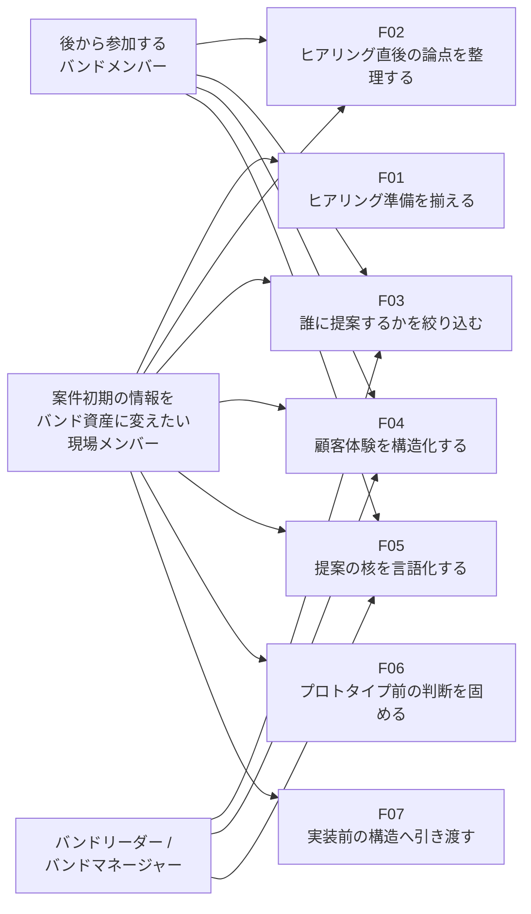
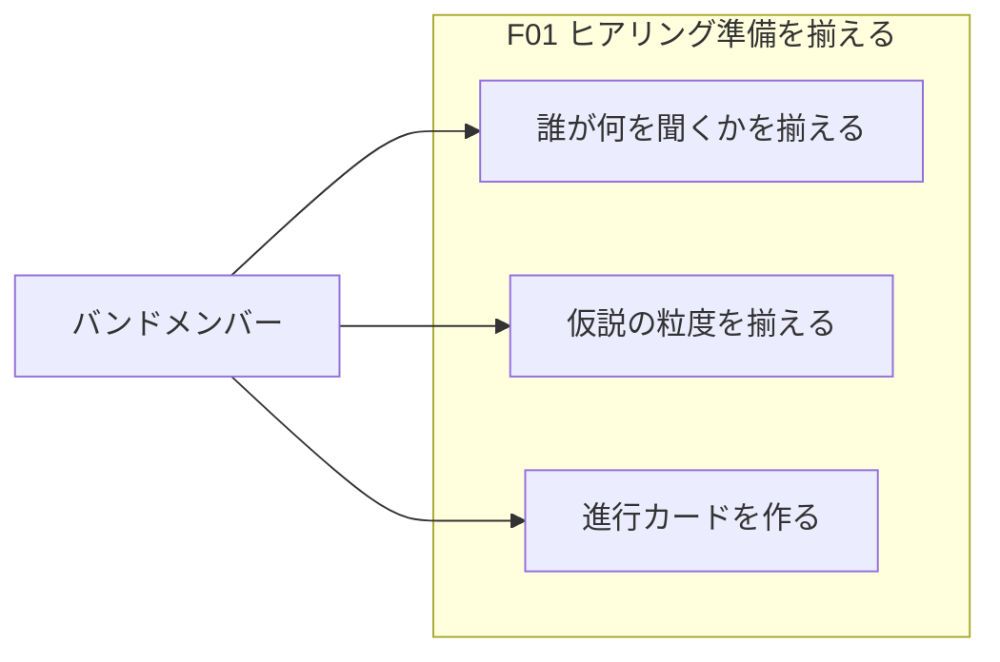
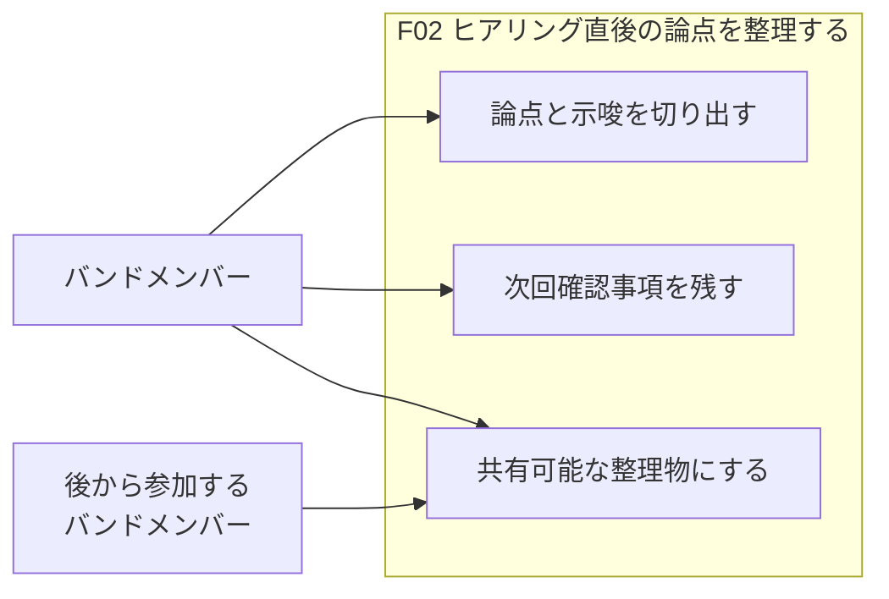
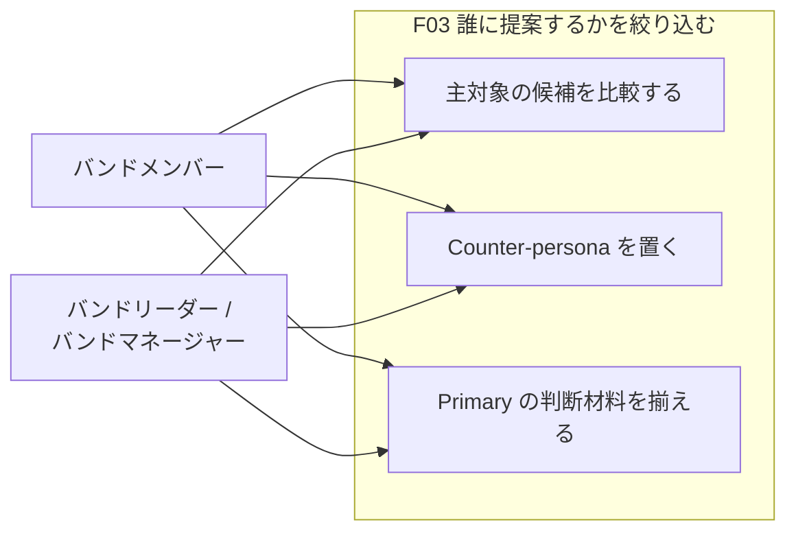
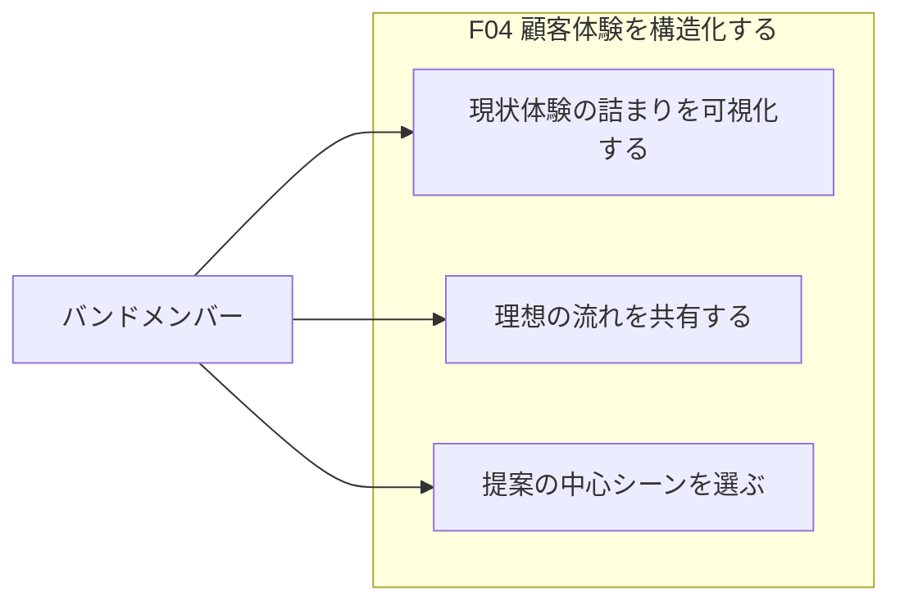
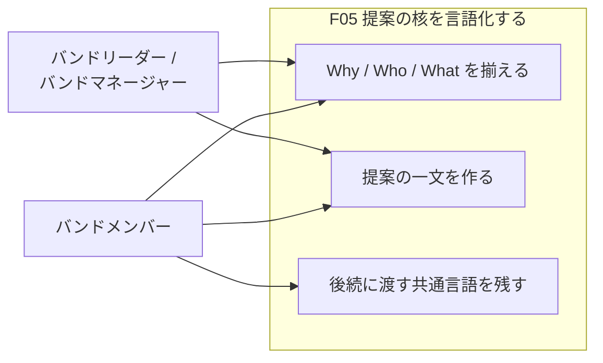
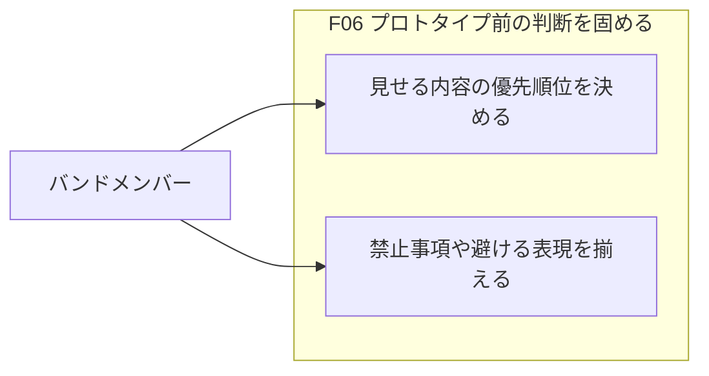
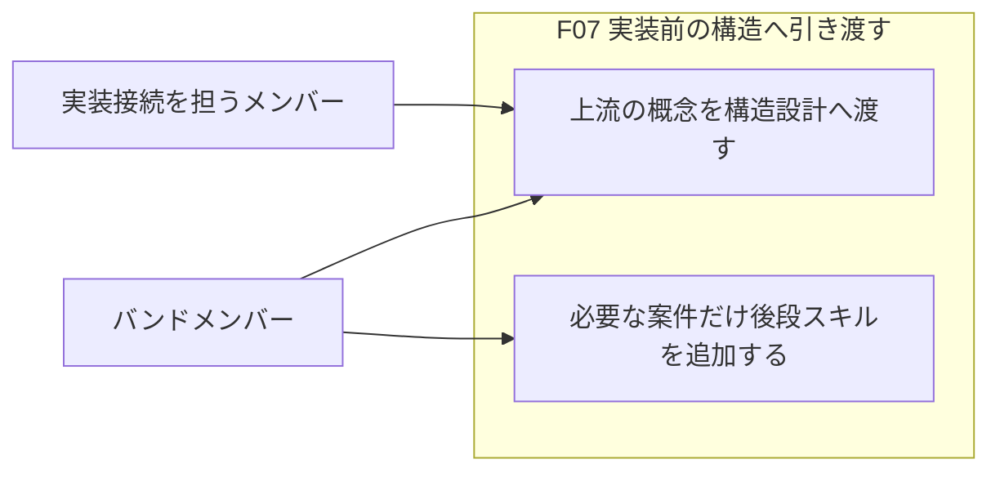

# Prhythm ユースケーススケッチ

> Persona が固まった段階で、機能と利用シーンを粗く揃えるための土台。  
> 実装仕様ではなく、誰にどんな価値を返すかを確認するための資料。

## 前提

- 参照した入力ソース:
  - `docs/prhythm-band-persona-stage2.md`
  - `docs/prhythm-band-persona-stage1.md`
- 今回のモード: 全体俯瞰
- 対象 Persona:
  - Primary candidate (hypothesis): 案件初期の情報をバンド資産に変えたい現場メンバー
- メモ:
  - この出力はコードベース分析ではなく、Persona 文書からのスケッチ
  - `Fact` より `Assumption` が多く、仮説段階の利用シーンを含む

## Actor / Persona 一覧

| Actor | 概要 | 主な状況 | 主な目的 |
|---|---|---|---|
| 案件初期の情報をバンド資産に変えたい現場メンバー | 既存または事後形成バンドで、ヒアリングや提案準備の断片を再利用可能な材料に変えたい主役 | ヒアリング前後、提案整理、必要時の体験整理・プロトタイプ前判断 | 案件初期の情報を、後から入る人も使える判断材料へ変える |
| 後から参加するバンドメンバー | 途中から案件に入る読み手・共同作業者 | 既存の整理物を読んで文脈を追う場面 | いま何が決まっていて、次に何をすべきかを追える |
| バンドリーダー / バンドマネージャー | 推進責任を持ち、成果物の整合性を気にする周辺 Actor | 提案品質や進め方を均したい場面 | バンド全体で筋の通った進め方を維持する |

## 機能一覧

| 機能ID | 機能名 | 何を可能にするか | 主な対象 Actor | 代表ユースケース数 |
|---|---|---|---|---|
| F01 | ヒアリング準備を揃える | バンドで何を聞き、どこまで仮説を持って入るかを揃えられる | バンドメンバー | 3 |
| F02 | ヒアリング直後の論点を整理する | 発言ログを次の判断につながる論点へ変換できる | バンドメンバー | 3 |
| F03 | 誰に提案するかを絞り込む | 主対象の利用者や役割を比較し、提案先を狭められる | バンドメンバー、バンドリーダー | 3 |
| F04 | 顧客体験を構造化する | 現状の詰まりと理想の流れを、チームで同じ絵として持てる | バンドメンバー | 3 |
| F05 | 提案の核を言語化する | Why / Who / What を揃え、説明する人ごとの差を減らせる | バンドメンバー、バンドリーダー | 3 |
| F06 | プロトタイプ前の判断を固める | 必要な案件だけ、UI を作る前に何を見せるか・何を避けるかを決められる | バンドメンバー | 2 |
| F07 | 実装前の構造へ引き渡す | 必要な案件だけ、上流で決めた言葉を実装前の構造設計へつなげられる | バンドメンバー、実装接続を担うメンバー | 2 |

## 全体ユースケース図

## ユースケース一覧

| UC ID | 機能ID | 機能名 | ユースケース | 主アクター | 利用シーン | 期待結果 | 確度 |
|---|---|---|---|---|---|---|---|
| UC-F01-01 | F01 | ヒアリング準備を揃える | バンドで誰が何を聞くかを揃えられる | バンドメンバー | ヒアリング前日 | 当日の役割分担が曖昧なまま始まらない | Fact |
| UC-F01-02 | F01 | ヒアリング準備を揃える | 会話前に仮説の粒度を揃えられる | バンドメンバー | 仮説を持って顧客に入る直前 | 個人戦ではなくチームで入れる | Assumption |
| UC-F01-03 | F01 | ヒアリング準備を揃える | 抜け漏れの少ない進行カードを作れる | バンドメンバー | 会議前の短時間準備 | その場で聞き忘れを減らせる | Assumption |
| UC-F02-01 | F02 | ヒアリング直後の論点を整理する | 発言ログから論点と示唆を切り出せる | バンドメンバー | ヒアリング直後 | 議事録だけ残って終わらない | Fact |
| UC-F02-02 | F02 | ヒアリング直後の論点を整理する | 次回確認事項を明確にできる | バンドメンバー | 次回アクションを決める場面 | 次に何を聞くかが残る | Assumption |
| UC-F02-03 | F02 | ヒアリング直後の論点を整理する | 後から入るメンバーにも追える形で整理を残せる | バンドメンバー | 共有用の整理物を残す場面 | 文脈の引き継ぎがしやすい | Assumption |
| UC-F03-01 | F03 | 誰に提案するかを絞り込む | 主対象の利用者候補を比較できる | バンドメンバー | 提案対象を検討する場面 | 全員向けの薄い提案を避けられる | Assumption |
| UC-F03-02 | F03 | 誰に提案するかを絞り込む | Counter-persona を含めて設計の境界を確認できる | バンドメンバー、バンドリーダー | 誰を捨てるかも含めて議論したい場面 | 最適化の境界が見える | Assumption |
| UC-F03-03 | F03 | 誰に提案するかを絞り込む | Primary persona を人間が判断しやすい材料を揃えられる | バンドリーダー / バンドマネージャー | 意思決定前の比較場面 | 判断を急がずに済む | Assumption |
| UC-F04-01 | F04 | 顧客体験を構造化する | 現状体験の詰まりを可視化できる | バンドメンバー | 課題を体験として捉え直す場面 | 抽象論だけの議論を減らせる | Assumption |
| UC-F04-02 | F04 | 顧客体験を構造化する | 理想の流れをチームで共有できる | バンドメンバー | To-Be を揃えたい場面 | 同じ絵を見ながら議論できる | Assumption |
| UC-F04-03 | F04 | 顧客体験を構造化する | 提案の核につながるシーンを選び出せる | バンドメンバー | どこを提案の中心に置くか決める場面 | 提案範囲を絞れる | Assumption |
| UC-F05-01 | F05 | 提案の核を言語化する | Why / Who / What を一貫した形で言語化できる | バンドメンバー | 提案の方向性を整理する場面 | 説明する人ごとの差が減る | Fact |
| UC-F05-02 | F05 | 提案の核を言語化する | 提案の筋を一文で共有できる | バンドメンバー、バンドリーダー | 社内共有や顧客共有の前 | 認識ズレを抑えられる | Assumption |
| UC-F05-03 | F05 | 提案の核を言語化する | 後続スキルに渡すための共通言語を残せる | バンドメンバー | 次の整理や設計に渡す場面 | 再翻訳の手間を減らせる | Assumption |
| UC-F06-01 | F06 | プロトタイプ前の判断を固める | UI を作る前に見せる内容の優先順位を決められる | バンドメンバー | プロトタイプ作成前 | 作り始めてからの揺り戻しを減らせる | Assumption |
| UC-F06-02 | F06 | プロトタイプ前の判断を固める | 禁止事項や避けるべき表現を先に揃えられる | バンドメンバー | 表現方針を決める場面 | デザインの迷走を防げる | Assumption |
| UC-F07-01 | F07 | 実装前の構造へ引き渡す | 上流で決めた概念をそのまま構造設計へ渡せる | バンドメンバー | 提案後に実装前整理へ進む場面 | 言葉の再解釈を減らせる | Assumption |
| UC-F07-02 | F07 | 実装前の構造へ引き渡す | 実装接続が必要な案件だけ後段スキルを追加できる | バンドメンバー | 案件ごとの差分を吸収したい場面 | 全スキル連続利用を前提にせず、必要なときだけ深掘りできる | Unknown |

F01 ヒアリング準備を揃える

### 機能の要約

ヒアリング前に、バンドとして何を聞き、どこまで仮説を持って入るかを揃えるための機能。  
個人ごとの準備差を減らし、会議当日の抜け漏れを抑える。

### ユースケース図

### ユースケース一覧

| UC ID | ユースケース | 主アクター | 利用シーン | 期待結果 | 確度 |
|---|---|---|---|---|---|
| UC-F01-01 | バンドで誰が何を聞くかを揃えられる | バンドメンバー | ヒアリング前日 | 役割分担が曖昧なまま始まらない | Fact |
| UC-F01-02 | 会話前に仮説の粒度を揃えられる | バンドメンバー | 顧客に入る直前 | 個人戦ではなくチームで入れる | Assumption |
| UC-F01-03 | 抜け漏れの少ない進行カードを作れる | バンドメンバー | 会議前の短時間準備 | 聞き忘れを減らせる | Assumption |

### 前提 / 未確定事項

- どこまで事前に仮説を固定するかは案件ごとに変わる
- 個人の初動速度を優先する場面では重く見える可能性がある

F02 ヒアリング直後の論点を整理する

### 機能の要約

ヒアリング直後に、発言ログをそのまま保存するのではなく、論点・示唆・次回確認事項へ変換する機能。  
会議の熱が残っているうちに、次の提案判断へつながる形へ整理する。

### ユースケース図

### ユースケース一覧

| UC ID | ユースケース | 主アクター | 利用シーン | 期待結果 | 確度 |
|---|---|---|---|---|---|
| UC-F02-01 | 発言ログから論点と示唆を切り出せる | バンドメンバー | ヒアリング直後 | 議事録だけ残って終わらない | Fact |
| UC-F02-02 | 次回確認事項を明確にできる | バンドメンバー | 次回アクションを決める場面 | 次に何を聞くかが残る | Assumption |
| UC-F02-03 | 後から入るメンバーにも追える形で整理を残せる | バンドメンバー | 共有用の整理物を残す場面 | 文脈の引き継ぎがしやすい | Assumption |

### 前提 / 未確定事項

- どこまで詳細な議事録が必要かは別論点
- 「即時整理」と「後で丁寧に整理」のどちらを優先するかは未確定

F03 誰に提案するかを絞り込む

### 機能の要約

顧客企業の中でも誰を主対象に置くかを比較し、Primary persona を定めるための機能。  
「全員向け」の提案に流れず、設計の境界も含めて判断材料を揃える。

### ユースケース図

### ユースケース一覧

| UC ID | ユースケース | 主アクター | 利用シーン | 期待結果 | 確度 |
|---|---|---|---|---|---|
| UC-F03-01 | 主対象の利用者候補を比較できる | バンドメンバー | 提案対象を検討する場面 | 全員向けの薄い提案を避けられる | Assumption |
| UC-F03-02 | Counter-persona を含めて設計の境界を確認できる | バンドメンバー、バンドリーダー / バンドマネージャー | 誰を捨てるかも含めて議論したい場面 | 最適化の境界が見える | Assumption |
| UC-F03-03 | Primary persona を人間が判断しやすい材料を揃えられる | バンドリーダー / バンドマネージャー | 意思決定前の比較場面 | 判断を急がずに済む | Assumption |

### 前提 / 未確定事項

- Agent が Primary を決めない前提は維持する
- 個人先行案件では、この比較工程自体が重い可能性がある

F04 顧客体験を構造化する

### 機能の要約

現状の体験の詰まりと理想の流れを、バンド内で共通の絵として扱うための機能。  
論点が抽象論に流れる前に、具体的な体験シーンへ固定する。

### ユースケース図

### ユースケース一覧

| UC ID | ユースケース | 主アクター | 利用シーン | 期待結果 | 確度 |
|---|---|---|---|---|---|
| UC-F04-01 | 現状体験の詰まりを可視化できる | バンドメンバー | 課題を体験として捉え直す場面 | 抽象論だけの議論を減らせる | Assumption |
| UC-F04-02 | 理想の流れをチームで共有できる | バンドメンバー | To-Be を揃えたい場面 | 同じ絵を見ながら議論できる | Assumption |
| UC-F04-03 | 提案の核につながるシーンを選び出せる | バンドメンバー | 提案範囲を決める場面 | 提案範囲を絞れる | Assumption |

### 前提 / 未確定事項

- すべての案件で体験整理が必要とは限らない
- シーン粒度をどこまで細かく切るかは案件依存

F05 提案の核を言語化する

### 機能の要約

Why / Who / What を一貫した形で言語化し、提案の筋を揃える機能。  
説明者ごとに言い方がぶれる状態を避け、後続スキルにも渡せる共通言語を残す。

### ユースケース図

### ユースケース一覧

| UC ID | ユースケース | 主アクター | 利用シーン | 期待結果 | 確度 |
|---|---|---|---|---|---|
| UC-F05-01 | Why / Who / What を一貫した形で言語化できる | バンドメンバー | 提案の方向性を整理する場面 | 説明する人ごとの差が減る | Fact |
| UC-F05-02 | 提案の筋を一文で共有できる | バンドメンバー、バンドリーダー / バンドマネージャー | 社内共有や顧客共有の前 | 認識ズレを抑えられる | Assumption |
| UC-F05-03 | 後続スキルに渡すための共通言語を残せる | バンドメンバー | 次の整理や設計に渡す場面 | 再翻訳の手間を減らせる | Assumption |

### 前提 / 未確定事項

- 一文ステートメントの長さや硬さは利用先によって変わる
- ここでの言語化が本当に後段設計で再利用されるかは未検証

F06 プロトタイプ前の判断を固める

### 機能の要約

UI を作り始める前に、何を見せるか、何を禁止するか、どの surface を選ぶかを整理する機能。  
実装やデザイン着手後の揺り戻しを減らす。

### ユースケース図

### ユースケース一覧

| UC ID | ユースケース | 主アクター | 利用シーン | 期待結果 | 確度 |
|---|---|---|---|---|---|
| UC-F06-01 | UI を作る前に見せる内容の優先順位を決められる | バンドメンバー | プロトタイプ作成前 | 作り始めてからの揺り戻しを減らせる | Assumption |
| UC-F06-02 | 禁止事項や避けるべき表現を先に揃えられる | バンドメンバー | 表現方針を決める場面 | デザインの迷走を防げる | Assumption |

### 前提 / 未確定事項

- プロトタイプを作らない案件では不要
- surface 選択まで同一スキルで扱うかは今後の検証余地がある

F07 実装前の構造へ引き渡す

### 機能の要約

上流で決めた概念や用語を、必要な案件だけ実装前の構造設計へ引き渡すための機能。  
提案と構造設計の間で、言葉が切れて再整理になることを避ける。

### ユースケース図

### ユースケース一覧

| UC ID | ユースケース | 主アクター | 利用シーン | 期待結果 | 確度 |
|---|---|---|---|---|---|
| UC-F07-01 | 上流で決めた概念をそのまま構造設計へ渡せる | バンドメンバー | 提案後に実装前整理へ進む場面 | 言葉の再解釈を減らせる | Assumption |
| UC-F07-02 | 実装接続が必要な案件だけ後段スキルを追加できる | バンドメンバー | 案件ごとの差分を吸収したい場面 | 必要なときだけ深掘りできる | Unknown |

### 前提 / 未確定事項

- ここまでを同一導線で見せるべきかは未確定
- 上流価値より後段スキル単体で比較されるリスクがある

