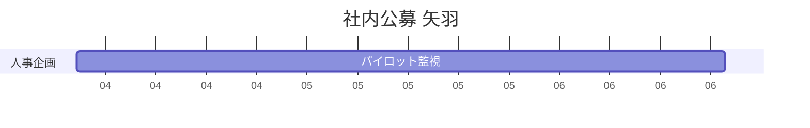

# delivery-phase-plan

## 概要

主指標の現状と目標、パイロットの規模を渡すと、役割を横レーン、時期と判定を縦のフェーズに載せた図にする。本 README ではこの図を「矢羽」と呼ぶ。各ゲートに Go/No-Go の判定を書き、最終ゲートには未達のときの一手を付ける。成果物は `docs/delivery-phase-plan.md` で、図そのものが共有物。仮説の優先順位そのものは `uncertainty-map` で扱う。

## 利用メリット

- いつ何で Go するかが顧客と共有できるので、提案が「作ったあとどうする」まで具体になる。
- 誰がいつ動くかが 1 枚で見える。
- 未達の一手が先に書いてあるので、パイロットが確認作業で終わらない。

## 利用シーン

- パイロットしたいが、期間、規模、判定が空のとき
- 「検証します」だけで、失格条件がないとき
- 体制はあるが、1 枚の矢羽になっていないとき

依頼の例: 「役割別の矢羽で検証計画を作って」

## 使い方

**いつ使うか:** パイロットしたいが、期間、規模、Go/No-Go が空のときに入る。`delivery-team-plan` で役割が見えたあと（無くても仮レーンで進む）、または `uncertainty-map` でコアかつ未検証が見えたあとに使うことが多い。体制と RACI そのものは `delivery-team-plan` へ。

1. ユーザーが主指標の現状と目標、パイロットの規模を渡す。役割レーンはあれば使う。無ければスキルが仮レーンを置く。
2. スキルがフェーズ名、期間、ゲート、判定を出す。ユーザーが背骨を見てから矢羽に載せる。
3. スキルが役割を横レーン、時期と判定を縦のフェーズに置き、`docs/delivery-phase-plan.md` にまとめる。

## 具体例

依頼: 「役割別の矢羽で検証計画を作って。社内公募アプリの応募率を 1.2% から 10% にしたい。」

::: info 出力される `docs/delivery-phase-plan.md` の抜粋:

| PHASE | Name | Duration | Gate | Judgment |
|---|---|---|---|---|
| 2 | パイロット | 3ヶ月 · 2部署 50名 | パイロット完了 | 「気になる」月40件 / 越境開始 30件 |
| 3 | 評価・展開判断 | 1ヶ月 | Go / No-Go | 体験者50名・継続率60%。未達なら概念を再検討 |
| ... | ... | ... | ... | ... |

| ROLE / PHASE | 2 パイロット | 3 評価・展開 |
|---|---|---|
| A 人事企画 · 鈴木さん | 週次モニタリング → 展開判断 | *(span from 2)* |
| C 現場チャンピオン | 登録・呼びかけ | 体験者インタビュー |
| ... | ... | ... |



:::

全文は [references/example-uchinaka.md](references/example-uchinaka.md) を参照。

## 構成

```
delivery-phase-plan/
├── README.md
├── SKILL.md
├── references/
│   ├── intake.md
│   ├── yahane-grammar.md     # レーン、矢羽、ゲートの書き方
│   └── example-uchinaka.md   # 矢羽の見本
└── templates/
    └── docs/
        ├── index.md
        └── sections.html
```

## 前提条件

- 主指標の現状値と目標値。
- パイロットの規模（誰 × 何人 × 期間）。

## 注意事項

- 実装したことを検証済と書かない。
- 全レーンを全フェーズに伸ばさない。空白は正常。ゲート無しのガントにしない。
- 主指標は現状と目標の両方を書く。片方だけでは出さない。

## 関連スキル

| スキル | 関係 |
|--------|------|
| [delivery-team-plan](../delivery-team-plan/README.md) | 役割レーンの源。無くても仮レーンで進む |
| [uncertainty-map](../uncertainty-map/README.md) | コアかつ未検証を時期に載せる。検証手段のカタログはあちら |
| [proto-storyboard](../proto-storyboard/README.md) | 提案パックのデモ台本を書きたいときに使う |
| [prhythm-docs](../prhythm-docs/README.md) | 出力を打ち合わせ用の Markdown と HTML にまとめたいときに使う |
