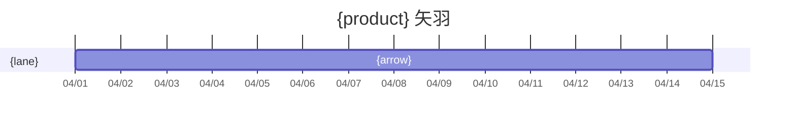

# 矢羽 grammar

Read after the user confirms the phase spine. Do not add phases here.

## Phase spine

Default **4** columns. Allowed 3–5. Names follow the case; do not force the demo labels.

| # | Default name | Gate |
|---|--------------|------|
| 0 | 設計・提案 | 提案承認 |
| 1 | 準備 | 開始判定 |
| 2 | パイロット | パイロット完了 |
| 3 | 評価・展開 | Go / No-Go |

Each gate has an **observable judgment** (count, rate, named artifact). The last gate also has a **miss move** (what changes if the number misses).

North-star sits above the chart: `{current} → {target}`. Both sides required.

## Lanes

One row per role from `delivery-team-plan` (or inferred lanes). Order: Owner, exec lanes, 瞬作 last.

Empty cells are valid. If a lane works in every column, split the work or drop a column — wall-to-wall arrows hide the plan.

## Arrows

An arrow is **evidence-producing work** in that span.

Do:

- Name the outcome (`対象部署選定・説明会`, `計測実装・改善リリース`)
- Span adjacent phases when the same work continues (`grid-column: 4/6`)

Do not:

- Chore lists (`会議設定`, `Slack 案内`)
- Feature catalogs
- One arrow per cell if the work is the same activity — merge the span

## Markdown chart

GitHub cannot render chevrons. In `docs/delivery-phase-plan.md` use:

1. Phase + gate **table**
2. Lane × phase **table** (cell text = arrow label; `—` = empty)
3. Mermaid **gantt** as a time fallback

Leave CSS `clip-path` chevrons to `templates/docs/sections.html` (prhythm-docs).



Use relative durations if calendar dates are unknown (`2w`, `1M`, `3M`).

## Artifact: `docs/delivery-phase-plan.md`

```markdown
# 検証計画 — {product}

- **主指標:** {current} → {target}
- **パイロット:** {who × n × duration}
- **Lanes:** {from team-plan or ※推測}

## Phase spine

| PHASE | Name | Duration | Gate | Judgment |
|-------|------|----------|------|----------|
| 0 | 設計・提案 | | 提案承認 | |
| 1 | 準備 | | 開始判定 | |
| 2 | パイロット | | パイロット完了 | |
| 3 | 評価・展開 | | Go / No-Go | {miss move} |

## 矢羽 (lane × phase)

| ROLE / PHASE | 0 | 1 | 2 | 3 |
|--------------|---|---|---|---|
| {lane} | | | | |
| {lane} | — | | | |
| 瞬作 | | | | |

## Gantt

\`\`\`mermaid
gantt
    title {product}
    dateFormat X
    axisFormat %s
    section {lane}
    {arrow} :a1, 0, 2w
\`\`\`

## Next

- Run the first gate. Feed outcomes back to `uncertainty-map` (status only).
```

## Pre-send checklist

- [ ] North-star current → target
- [ ] 3–5 phases, each with a gate and a judgment
- [ ] Last gate has a miss move
- [ ] At least one empty lane-cell
- [ ] Arrows name evidence work, not chores
- [ ] Table + mermaid gantt both present
