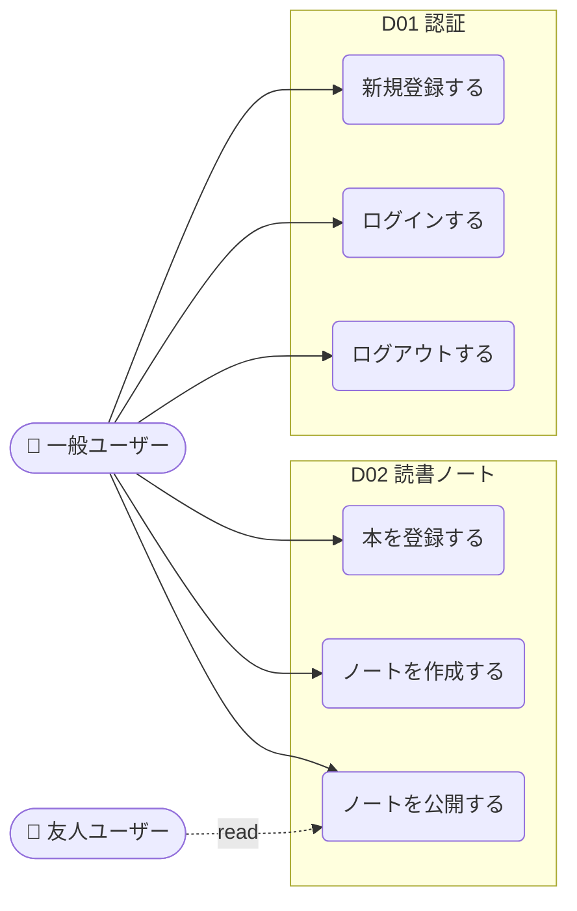

# ReadAlong ユースケースマップ

> 評価フィクスチャ。`feature-backlog-mapper` の Layer B シナリオ B-1 の入力として使う。
> 実プロジェクトでは [usecase-mapper](../../../usecase-mapper/) が同等の出力を生成する。

## システム概要

### アクター一覧

| アクター | 概要 |
|---|---|
| 一般ユーザー | 月 2-5 冊読む社会人。本登録・メモ作成・友人への公開を行う |
| 友人ユーザー | 一般ユーザーが招待した知人。公開メモを読み、リアクションを返す |

### ドメイン概要

| ID | ドメイン | 一行説明 | 主要画面 |
|---|---|---|---|
| D01 | 認証 | サインアップ・ログイン・ログアウト | `/signup`, `/login` |
| D02 | 読書ノート | 本登録・メモ作成・公開切替 | `/books`, `/books/:id`, `/notes/:id` |

## ユースケース一覧

| UC ID | ユースケース | アクター | ドメイン | 状態 | 関連API/画面 |
|---|---|---|---|---|---|
| UC-D01-01 | 新規登録する | 一般ユーザー | D01 認証 | 仮 | `POST /auth/signup` / `/signup` |
| UC-D01-02 | ログインする | 一般ユーザー | D01 認証 | 仮 | `POST /auth/login` / `/login` |
| UC-D01-03 | ログアウトする | 一般ユーザー | D01 認証 | 仮 | `POST /auth/logout` / — |
| UC-D02-01 | 本を登録する | 一般ユーザー | D02 ノート | 仮 | `POST /books` / `/books/new` |
| UC-D02-02 | ノートを作成する | 一般ユーザー | D02 ノート | 仮 | `POST /books/:id/notes` / `/books/:id` |
| UC-D02-03 | ノートを公開する | 一般ユーザー | D02 ノート | 仮 | `PATCH /notes/:id/visibility` / `/notes/:id` |

## 全体ユースケース図

---

D01 認証 — メール+パスワードによる最小限の認証

ユーザーが自分のメモを保護し、再開できる状態を作る。SAML / SSO は対象外。

### アクティビティ（ユースケース）→ API → 画面

| # | UC ID | ユースケース | アクター | メソッド | エンドポイント | 画面パス | 画面名 | 状態 |
|---|---|---|---|---|---|---|---|---|
| 1 | UC-D01-01 | 新規登録する | 一般ユーザー | POST | /auth/signup | /signup | サインアップ | 仮 |
| 2 | UC-D01-02 | ログインする | 一般ユーザー | POST | /auth/login | /login | ログイン | 仮 |
| 3 | UC-D01-03 | ログアウトする | 一般ユーザー | POST | /auth/logout | — | — | 仮 |

### キーポイント

- メール認証はあとで追加（仮では検証なし）
- パスワードリセットは Phase 2 で検討

D02 読書ノート — 本に紐付くメモを書き、公開を切り替える

ノートはツリー化せず、本に対して時系列に並ぶ。Markdown のみ対応。

### アクティビティ（ユースケース）→ API → 画面

| # | UC ID | ユースケース | アクター | メソッド | エンドポイント | 画面パス | 画面名 | 状態 |
|---|---|---|---|---|---|---|---|---|
| 1 | UC-D02-01 | 本を登録する | 一般ユーザー | POST | /books | /books/new | 本の登録 | 仮 |
| 2 | UC-D02-02 | ノートを作成する | 一般ユーザー | POST | /books/:id/notes | /books/:id | 本詳細 | 仮 |
| 3 | UC-D02-03 | ノートを公開する | 一般ユーザー | PATCH | /notes/:id/visibility | /notes/:id | ノート詳細 | 仮 |

### キーポイント

- 公開可視性は `private` / `friends` の 2 値のみ（パブリック公開は対象外）
- 友人招待・リアクションは別ユースケースとして扱う（このフィクスチャには含めない）

