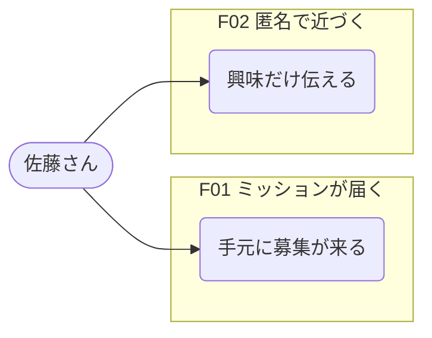

# function-usecase-map

## 概要

Persona、ビジョン、要件メモ、議事録などを渡すと、Actor（誰が）、Function（ユーザーに見える機能）、Use case（その機能を通じて達成する行為）の関係を整理し、全体俯瞰と機能別の Mermaid 図を `docs/usecase-map.md` に書く。コードは不要。別入力の全文例は [example.md](example.md)。

## 利用メリット

- 一覧表より先に、アクターと機能の関係が図で見えるので、抜け漏れに気づきやすい。
- 「ユーザーに見える機能」単位で話せるので、提案と検証の共通言語になる。
- 全体図と機能別図を切り替えられるので、議論の粒度を揃えやすい。

## 利用シーン

- Persona が決まったので、まず利用シーンを粗く出したいとき
- コードを書く前に、機能と利用関係の骨組みが欲しいとき
- 予約など、特定機能だけの詳細図が欲しいとき

依頼の例: 「Persona をもとにユースケースをスケッチして」「予約機能だけユースケース図にして」

## 使い方

**いつ使うか:** Primary ペルソナはいるが、機能と利用関係が見えないときに入る。`defining-personas-and-segments` と `create-journey-map` のあとが多い。骨組みの次に機能一覧や PBL が欲しくなったら `feature-backlog-map` へ。

1. ユーザーが全体俯瞰か、気になる機能だけの詳細かを決める。
2. ユーザーがペルソナ、ビジョン、要件メモを渡す。スキルがアクターと「誰が何を達成したいか」を並べる。
3. スキルが Mermaid の全体図と機能別図を `docs/usecase-map.md` にまとめる。機能別だけのときは全体図を省略できる。

## 具体例

依頼: 「Persona をもとにユースケースをスケッチして。社内公募アプリで、営業企画の佐藤さんが部署外のミッションに手を出す。」

::: info 出力される `docs/usecase-map.md` の抜粋:

| Actor / Persona | 概要 | 主な状況 | 主な目的 |
|---|---|---|---|
| 佐藤さん（営業企画） | 部署外の公募に興味はあるが応募直前で止まる主役 | イントラの募集一覧を眺める金曜夕方 | スキルに合うミッションへ、評価を気にせず一歩出せる |
| 人事企画 · 鈴木さん | 公募の運用と応募率を見る推進役 | 応募率が 1.2% のまま改善策を探している | 部署を越えた手挙げが起きている状態を作る |
| ... | ... | ... | ... |

| 機能ID | 機能名 | 何を可能にするか | 主な対象 Actor |
|---|---|---|---|
| F01 | ミッションが届く | 探しに行かなくても、スキルタグに合う募集が手元に来る | 佐藤さん |
| F02 | 匿名で近づく | 本名を出す前に、興味があることだけ伝えられる | 佐藤さん |
| ... | ... | ... | ... |



:::

## 構成

```text
function-usecase-map/
├── README.md
├── SKILL.md
├── templates/
│   └── docs/
│       ├── index.md       # 打ち合わせ用 Markdown の型（prhythm-docs が埋める）
│       └── sections.html  # スライド本体の型
└── example.md   # 別入力の全文例（バンド Persona）
```

## 前提条件

- Persona、Vision、要件メモ、議事録など、誰が何をしたいか分かる材料。

## 注意事項

- 実装済みか未実装かを断定しない。図は利用関係のスケッチであり、進捗管理表ではない。

## 関連スキル

| スキル | 関係 |
|--------|------|
| [defining-personas-and-segments](../defining-personas-and-segments/README.md) | Primary persona を決めてからこちらへ |
| [create-journey-map](../create-journey-map/README.md) | 体験シーンを時系列で掴んでから、機能の骨組みに落とすとき |
| [product-vision-and-concept](../product-vision-and-concept/README.md) | 体験を掴んだあと、提案の核を言語化したいときに使う |
| [feature-backlog-map](../feature-backlog-map/README.md) | ユースケースから機能一覧、PBL、受け入れ条件へ進むとき |
| [prototype-design-md](../prototype-design-md/README.md) | 機能スケッチから UI のトーン判断へ進むとき |
| [prhythm-docs](../prhythm-docs/README.md) | 出力を打ち合わせ用の Markdown と HTML にまとめたいときに使う |
