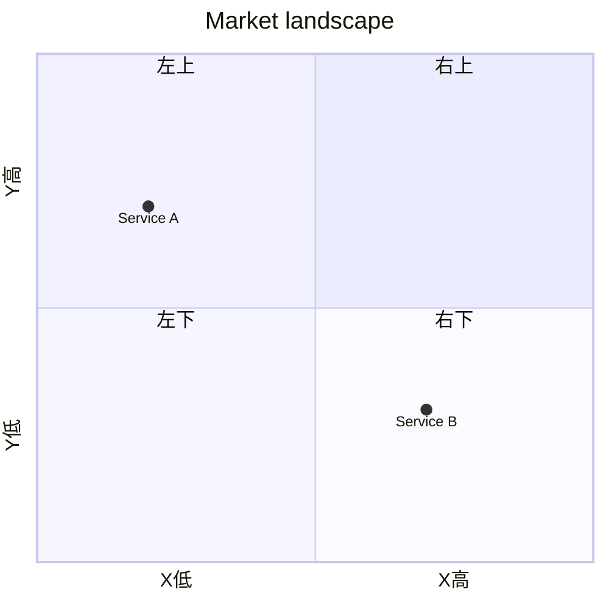

# Phase 3 — Four-Quadrant Service Map

確定した X/Y でサービスをプロットし、**空白の右上**を明示する。これが本スキルの主成果物。

## Preconditions

- Phase 2 の Confirmed Axes があること
- 無い場合は Phase 2 に戻る

## Goal

- 4 象限にサービス（またはクラスタ名）を配置
- 混雑地帯と空白地帯を言語化
- **右上**が空いているか、空いていないなら「なぜ埋まって見えるか / 本当の空白はどこか」を議論可能にする
- 自プロダクトの仮置き（★）を右上付近に置く（確定主張ではなく仮説）

## Placement rules

- 各サービスに X/Y の粗い位置（低/中/高）と 1 行根拠
- 根拠が弱いものは `※推測`
- 似たサービスはクラスタ名にまとめてよい（スライドの REFERENCES と同様）
- 非公式チャネルもプロットする（正式プロダクトだけだと右上が偽って空く）

## Output structure

順に出す:

### 1. Confirmed Axes（再掲）

| 軸 | 低（左/下） | 高（右/上） |
|----|------------|------------|
| **X** | | |
| **Y** | | |

### 2. Placement table

| Service / Cluster | X | Y | 根拠 |
|-------------------|:-:|:-:|------|
| {Name} | 低/中/高 | 低/中/高 | {1 行} |

### 3. Four-quadrant map

Mermaid `quadrantChart` または ASCII。右上に ★（自プロダクト仮説）と空白ラベル。

Mermaid 例:

````markdown

````

### 4. Quadrant readout

| 象限 | 何があるか | 混雑度 | 示唆 |
|------|-----------|--------|------|
| 右上 | | 空 / 薄い / 実は埋まってる | **本命の議論場** |
| 右下 | | | |
| 左上 | | | |
| 左下 | | | |

### 5. 空白の右上（必須）

1. **空いているか** — Yes / 薄い / No（見えて空なだけ）
2. **なぜ空いているか（仮説）** — 技術・組織・需要・チャネルのどれか
3. **取りにいくなら何が必要か** — 次のヒアリング / ビジョンで検証すべき一文
4. **偽の空白リスク** — 非公式手段や大企業が既に埋めている可能性

### 6. Next

- hearing で右上仮説を検証する質問
- product-vision-and-concept で「右上に立つ一文」を磨く

## Anti-patterns

- 軸未確定のままプロットする
- 右上が望ましい向きになっていない（軸の向きが逆）
- 全サービスを右上付近に寄せる（バラけていない）
- 「空白があります」だけで、なぜ空か・偽空白かを書かない
- 個別サービスの長文レビューに戻る（それは本フェーズの仕事ではない）
