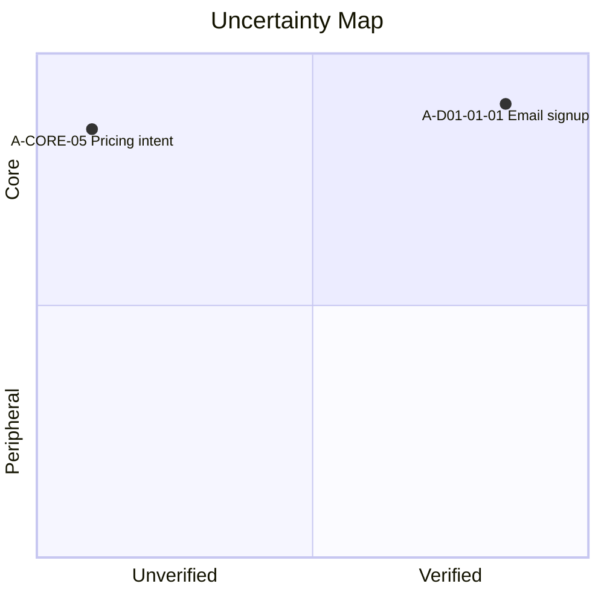

# uncertainty-map

> プロトの仮説を **コア/周辺 × 検証済/未検証** の 2x2 マトリクスで可視化するエージェントスキル。最もリスクの高い「コア × 未検証」を浮かび上がらせ、プロトで実際に確かめられた価値を整理する。

`feature-backlog-mapper` が出力した `docs/feature-list.md` の F ID を起点に、各機能の暗黙の仮説を抽出し、コア/周辺の判定とプロトでの検証ステータスを付与した状態で `docs/uncertainty-map.md` に書き出します。同じ仮説 ID を引き継ぎ、対外向けの `docs/proto-value-report.md` へ詳細化することもできます（エグゼサマ・検証済成果・残課題・デモ動線・次の検証計画）。

- **入力:** `docs/feature-list.md`（推奨）/ `docs/product-vision.md`（推奨）/ `DESIGN.md` + プロトコード（任意）/ 観察ログ・ヒアリングノート（任意）
- **出力:** Mode A は `docs/uncertainty-map.md`（4 象限 + 検証アクション）、Mode B は `docs/proto-value-report.md`（ステークホルダー向けレポート）
- **スコープ外:** ビジョン言語化（→ `product-vision-and-concept`）/ ユースケース抽出（→ `usecase-mapper`）/ 機能分解・PBI 化（→ `feature-backlog-mapper`）/ 検証スパイクの実装そのもの（別エージェントタスク）

---

## 概要

`docs/feature-list.md` の F ID と `docs/product-vision.md` のビジョンを物差しに、各機能の暗黙の仮説（assumption）を抽出します。**コア × 未検証** の象限を最優先のリスクとして浮上させ、**コア × 検証済** をプロトの成果としてまとめます。検証ステータスは ✅ 検証済 / 🟡 部分検証 / ⬜ 未検証 の 3 値で、「動かしただけで検証済」を防ぎます。出力は Markdown のため GitHub・VS Code でそのまま閲覧・差分レビューできます。

> **用語**: 本スキルの「コア価値」は **vision を成立させる仮説**（Why の核）を指します。`feature-backlog-mapper` の「コア機能 / Must」は **What の核** で、両者は別レイヤーです。本スキルでは Must 機能から抽出した暗黙の前提が「コア価値仮説」になります。

## 利用メリット

- **次に何を検証すべきかが一目で分かる** — コア × 未検証が Riskiest Assumption として最上段に並ぶので、限られた検証時間を最大リスクに投下できる
- **プロトの成果を過大評価せずに伝えられる** — 「実装した」と「ユーザーで確かめた」が分離されるので、対外発信で信用を毀損しない
- **対外コミュニケーションがブレない** — Mode B レポートでは検証済成果を自然言語で前面に出しつつ、未検証コアは隠さず「次の検証計画」で同居させるので、レビュー先・出席者ごとに資料を作り直さなくて済む
- **トレーサビリティが切れない** — Vision → Feature → Assumption → Validation Action が同じ ID 体系で繋がるので、後から「この検証はなぜ必要だったか」を再構成できる
- **仮説に合った検証手段に辿り着ける** — 「とりあえずユーザーテスト」を避け、仮説タイプ（価値 / 単価 / UX / 行動 / 自動化）に応じて適切な手段を選べるので、検証コストが過大にならない

## 利用シーン

- **プロトを作り終えて、次に何を検証すべきか決めたいとき** — コア × 未検証を最優先で並べ、検証スパイクの提案まで出す
- **投資家・経営層にプロトの成果を伝えたいとき** — 検証済を主役に、未検証も計画として併記する正直なレポートを出す
- **「動かしてるから検証済」を防ぎたいとき** — 3 値ステータスで「実装した」と「ユーザーで確かめた」を区別する
- **検証手段が「とりあえずユーザーテスト」になりがちなとき** — 9 種カタログから仮説に合った手段を選ばせる
- **プロト後の優先順位会議の前に、議論の起点となる図を用意したいとき** — マトリクス + 4 象限の推奨アクションが揃った状態で会議を開始できる

依頼の例:

```
docs/feature-list.md から不確実性マップを作って
プロトで何が検証できたか整理して
投資家向けにプロト価値レポートを作って
次に何を検証すべき？
```

## 使い方

Claude Code / Cursor 上で次のように依頼すると起動します。

```
/uncertainty-map docs/feature-list.md から不確実性マップを作って
/uncertainty-map Mode B でプロト価値レポートにして
```

スラッシュ無しでも、不確実性マップ・仮説検証・プロト価値・Riskiest Assumption・validation map などのキーワードを含む依頼で自動起動します。

入力ソース（`docs/product-vision.md` / `docs/feature-list.md` / `DESIGN.md` / プロトのコードベース）が混在する場合、対象を伝えると正確に動きます。

## 出力例（抜粋）

**Mode A — 4 象限マトリクス + 検証アクション (`docs/uncertainty-map.md`)**

````markdown


## コア × 未検証 (最優先)
| A ID | 仮説 | 紐付 F | 軸1 根拠 | 推奨検証手段 |
|---|---|---|---|---|
| A-CORE-05 | ターゲットは月額 X 円を支払う | F-D04-01 | vision「持続可能な事業として」 | LP + Stripe スモークテスト |

## 次の検証アクション
| A ID | 検証手段 | 必要工数 | 期待結果 | 失格条件 |
|---|---|---|---|---|
| A-CORE-05 | スモークテスト | 5 日 | CVR 3% 以上 | CVR 1% 未満 |
````

**Mode B — ステークホルダー向けレポート (`docs/proto-value-report.md`)**

```markdown
## エグゼサマ
本プロトでは、コア仮説 7 件のうち 3 件を実ユーザー検証で確認、2 件は実装レベルで動作確認しました [^1]。
残る 2 件のコア仮説（特に課金意思）が次サイクルの最優先テーマです。

## 検証済成果
### 1. メール登録動線が 1 分以内で完了
5 名のユーザーが平均 47 秒で登録を完了。脱落者は 0 名でした [^2]。

[^1]: 全仮説 12 件 / コア 7 / 周辺 5 / ✅3 / 🟡2 / ⬜2
[^2]: A-D01-01-01 / F-D01-01 / 観察ログ docs/usability-log.md#L23
```

詳細テンプレートは [`references/matrix-template.md`](references/matrix-template.md) と [`references/report-template.md`](references/report-template.md) を参照。

## 構成

```
uncertainty-map/
├── SKILL.md                       # エージェントが読む本体（モデル向け、英語）
├── README.md                      # 本ファイル（人間向け、日本語）
└── references/                    # 進行のための詳細
    ├── intake.md                  # 入力ソース確認 + ハイブリッド戦略
    ├── assumption-extraction.md   # 仮説の粒度・ID 規則・抽出ヒューリスティック
    ├── core-vs-peripheral.md      # 軸 1 の判定（vision / Must / 対話）
    ├── verification-classifier.md # 軸 2 の判定（3 ラベル + コード分析）
    ├── matrix-template.md         # Mode A 出力テンプレ
    ├── report-template.md         # Mode B 出力テンプレ（標準 6 セクション）
    ├── action-playbook.md         # 4 象限 × 推奨アクション + 9 種検証手段カタログ
    ├── quality-checklist.md       # emit 前ゲート
    ├── eval-scenarios.md          # Layer A/B/C 評価シナリオ + プロンプト
    └── eval-rubric.md             # 観測すべき合否項目チェックリスト
```

## 前提条件

- Claude Code または Cursor（プラグイン `prhythm` の一部として配布）
- 推奨入力 `docs/product-vision.md`（[product-vision-and-concept](../product-vision-and-concept/) で生成）
- 推奨入力 `docs/feature-list.md`（[feature-backlog-mapper](../feature-backlog-mapper/) で生成）
- 任意入力 `DESIGN.md`（[prototype-design-md](../prototype-design-md/) で生成）+ プロトの実装コード

## 注意事項

- **「動かした」と「検証した」は別** — ユーザー観察 / 計測の根拠がない限り ✅ にはなりません。実装+テストのみは 🟡 部分検証どまりです
- **コア判定の根拠が必須** — vision の引用 or `feature-list.md` の Must 根拠が無いと「コア」には置きません
- **Mode B でも未検証コアは隠さない** — 投資家向けレポートでも「残課題」「次の検証計画」に必ず併記します
- **検証手段は 9 種から選ぶ** — 「ユーザーテスト」一択を避けるカタログを内蔵しています
- **数値の捏造禁止** — ユーザー観察人数・期間・計測値は文書から確認できないものは `—` で残します
- 出力は Markdown のみで、HTML スライド連携や外部 PBI ツール連携は行いません

## 関連スキル

| スキル | 関係 |
|--------|------|
| [product-vision-and-concept](../product-vision-and-concept/) | 上流。コア判定の最上位の物差しを提供する |
| [feature-backlog-mapper](../feature-backlog-mapper/) | 上流。F ID と Must/Should/Could 分類を提供する |
| [prototype-design-md](../prototype-design-md/) | 上流。プロト範囲（DESIGN.md）の解釈源 |
| [usecase-mapper](../usecase-mapper/) | 間接上流。F ID 経由で UC ID にもトレース可能 |
| [prhythm-skill-review](../prhythm-skill-review/) | メタ。本スキルの評価ループ（Layer A/B/C）を回す相方 |
