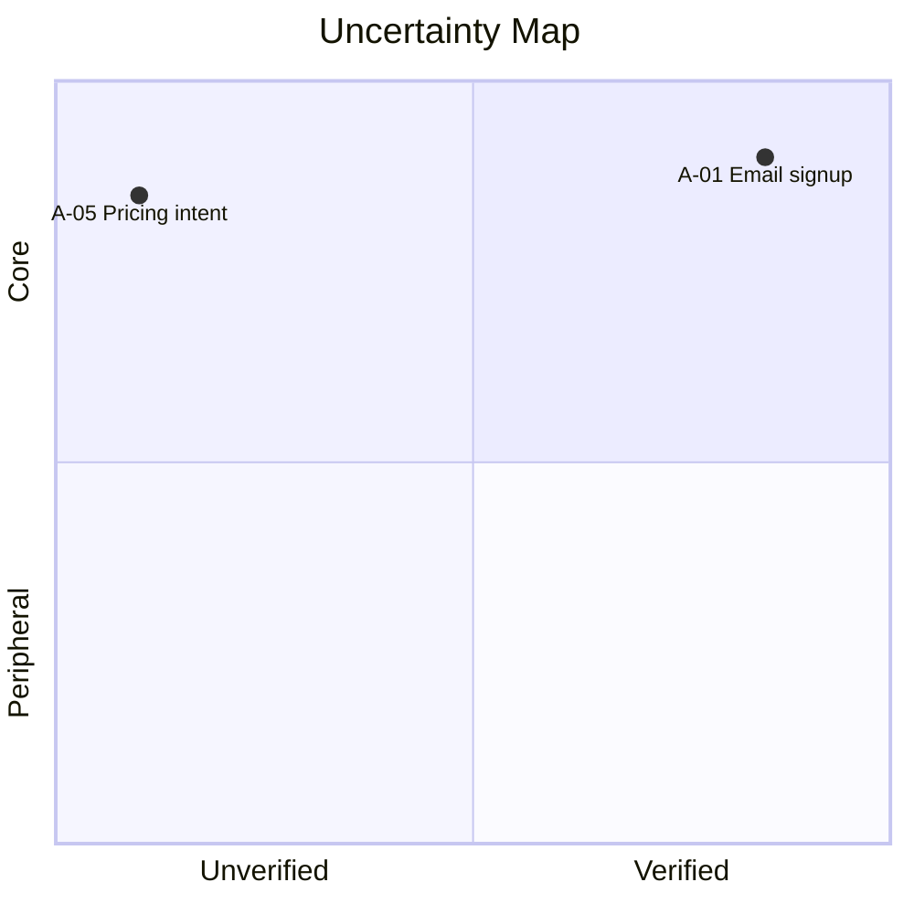

# uncertainty-map

> プロトの仮説を **コア/周辺 × 検証済/部分検証/未検証** の 2x2 で可視化するエージェントスキル。最もリスクの高い「コア × 未検証」を浮かび上がらせ、次に何を検証すべきかを示す。

ビジョン・プロト実装・`docs/feature-list.md`（あれば）のいずれかを起点に、各機能の暗黙の仮説を抽出し、コア/周辺の判定とプロトでの検証ステータスを付与して `docs/uncertainty-map.md` に書き出します。**モードは 1 つ**——可視化された不確実性マップそのものが成果物であり、共有物です。

- **入力:** `docs/product-vision.md` / `docs/feature-list.md` / `DESIGN.md` + プロトコード / 観察ログ（すべて任意・単体成立）
- **出力:** `docs/uncertainty-map.md`（Mermaid quadrantChart の可視化 + 4 象限の詳細表 + 次の検証アクション）
- **スコープ外:** ビジョン言語化（→ `product-vision-and-concept`）/ ユースケース抽出（→ `usecase-mapper`）/ 機能分解（→ `feature-backlog-mapper`、行き来する反復関係）/ 検証結果の記録（→ `validation-log`）/ 検証スパイクの実装そのもの

---

## 概要

ビジョンと、あれば機能一覧を物差しに、各機能の暗黙の仮説（assumption）を抽出します。**コア × 未検証** の象限を最優先のリスクとして浮上させ、2x2 を **Mermaid quadrantChart で可視化** します。検証ステータスは ✅ 検証済 / 🟡 部分検証 / ⬜ 未検証 の 3 値で、「動かしただけで検証済」を防ぎます。出力は Markdown のため GitHub・VS Code でそのまま閲覧・差分レビューでき、マップ自体がチームや関係者への共有物になります。

> **用語**: 本スキルの「コア価値」は **vision を成立させる仮説**（Why の核）を指します。`feature-backlog-mapper` の機能は **What の核** で、両者は別レイヤーです。高優先度の機能から抽出した暗黙の前提が「コア価値仮説」になります。
>
> **関係**: `feature-backlog-mapper` とは一方向の上流/下流ではなく、**行き来する反復関係**です。マップで浮いた不確実性を機能・優先度に反映し、また仮説を見直す——を繰り返します。

## 利用メリット

- **次に何を検証すべきかが一目で分かる** — コア × 未検証が Riskiest Assumption として浮上し、限られた検証時間を最大リスクに投下できる
- **マップ自体が共有物** — 可視化された 2x2 がそのまま議論・共有の起点になる。別途レポートを作り直す必要がない
- **プロトの成果を過大評価しない** — 「実装した(🟡)」と「ユーザーで確かめた(✅)」を分離するので、現状を正直に把握できる
- **単体で動く** — 機能一覧が無くても vision やプロトから生成できる。他スキルへの ID 依存を持たない
- **仮説に合った検証手段に辿り着ける** — 「とりあえずユーザーテスト」を避け、価値仮説(#1-9)・技術仮説(#10-14)で適切な手段を選べる

## 利用シーン

- **プロトを作り終えて、次に何を検証すべきか決めたいとき** — コア × 未検証を最優先で並べ、検証スパイクの提案まで出す
- **「動かしてるから検証済」を防ぎたいとき** — 3 値ステータスで「実装した」と「ユーザーで確かめた」を区別する
- **検証手段が「とりあえずユーザーテスト」になりがちなとき** — 14 種カタログから仮説に合った手段を選ばせる
- **プロト後の優先順位会議の前に、議論の起点となる図を用意したいとき** — quadrantChart + 4 象限の推奨アクションが揃った状態で会議を開始できる

依頼の例:

```
不確実性マップを作って
このプロトで次に何を検証すべき？
docs/feature-list.md を起点に仮説を整理して
Riskiest Assumption を出して
```

## 使い方

Claude Code / Cursor 上で次のように依頼すると起動します。

```
/uncertainty-map 不確実性マップを作って
/uncertainty-map 検証スパイクの結果を反映して更新して
```

スラッシュ無しでも、不確実性マップ・仮説検証・Riskiest Assumption・validation map などのキーワードを含む依頼で自動起動します。

入力ソース（`docs/product-vision.md` / `docs/feature-list.md` / `DESIGN.md` / プロトのコードベース）が混在する場合、対象を伝えると正確に動きます。

## 出力例（抜粋）

**可視化 + 検証アクション (`docs/uncertainty-map.md`)**

````markdown


## コア × 未検証 (最優先)
| A ID | 仮説 | 紐付 F | 軸1 根拠 | 推奨検証手段 |
|---|---|---|---|---|
| A-05 | ターゲットは月額 X 円を支払う | F-08 | vision「持続可能な事業として」 | LP + Stripe スモークテスト |

## 次の検証アクション
| A ID | 検証手段 | 必要工数 | 期待結果 | 失格条件 |
|---|---|---|---|---|
| A-05 | スモークテスト | 5 日 | CVR 3% 以上 | CVR 1% 未満 |
````

詳細テンプレートは [`references/matrix-template.md`](references/matrix-template.md) を参照。

## 構成

```
uncertainty-map/
├── SKILL.md                       # エージェントが読む本体（モデル向け、英語）
├── README.md                      # 本ファイル（人間向け、日本語）
└── references/                    # 進行のための詳細
    ├── intake.md                  # 入力ソース確認 + ハイブリッド戦略（単体成立）
    ├── assumption-extraction.md   # 仮説の粒度・ID 規則・抽出ヒューリスティック
    ├── core-vs-peripheral.md      # 軸 1 の判定（vision / 高優先度の機能 / 対話）
    ├── verification-classifier.md # 軸 2 の判定（3 ラベル + コード分析）
    ├── matrix-template.md         # 出力 + 可視化テンプレ
    ├── action-playbook.md         # 4 象限 × 推奨アクション + 14 種検証手段カタログ
    ├── quality-checklist.md       # emit 前ゲート
    ├── eval-scenarios.md          # Layer A/B/C 評価シナリオ + プロンプト
    └── eval-rubric.md             # 観測すべき合否項目チェックリスト
```

## 前提条件

- Claude Code または Cursor（プラグイン `prhythm` の一部として配布）
- 入力はすべて任意。`docs/product-vision.md`（[product-vision-and-concept](../product-vision-and-concept/) 生成）や `docs/feature-list.md`（[feature-backlog-mapper](../feature-backlog-mapper/) 生成）、`DESIGN.md`（[prototype-design-md](../prototype-design-md/) 生成）+ プロト実装があれば活用するが、無くても vision・プロトから生成できる

## 注意事項

- **「動かした」と「検証した」は別** — ユーザー観察 / 計測の根拠がない限り ✅ にはなりません。実装+テストのみは 🟡 部分検証どまりです
- **コア判定の根拠が必須** — vision の引用 or 高優先度の機能紐付が無いと「コア」には置きません
- **可視化が中心成果物** — quadrantChart + ASCII 図 + 象限別件数を必ず出します。マップ自体が共有物です
- **単体成立** — 他スキルの出力や ID 連携には依存しません。機能一覧があれば 紐付 F 列で連携します
- **検証手段は 14 種から選ぶ** — 価値仮説(#1-9) / 技術仮説(#10-14) で「ユーザーテスト」一択を避けます
- **数値の捏造禁止** — ユーザー観察人数・期間・計測値は文書から確認できないものは `—` で残します
- 出力は Markdown のみで、HTML スライド連携や外部 PBI ツール連携は行いません

## 関連スキル

| スキル | 関係 |
|--------|------|
| [product-vision-and-concept](../product-vision-and-concept/) | 任意の上流。コア判定の最上位の物差しを提供する |
| [feature-backlog-mapper](../feature-backlog-mapper/) | 並行。機能一覧/PBL を仮説抽出の seed に使う（行き来する反復関係） |
| [prototype-design-md](../prototype-design-md/) | 任意の上流。プロト範囲（DESIGN.md）の解釈源 |
| [usecase-mapper](../usecase-mapper/) | 間接。機能一覧経由で UC ID にもトレース可能 |
| [prhythm-skill-review](../prhythm-skill-review/) | メタ。本スキルの評価ループ（Layer A/B/C）を回す相方 |
