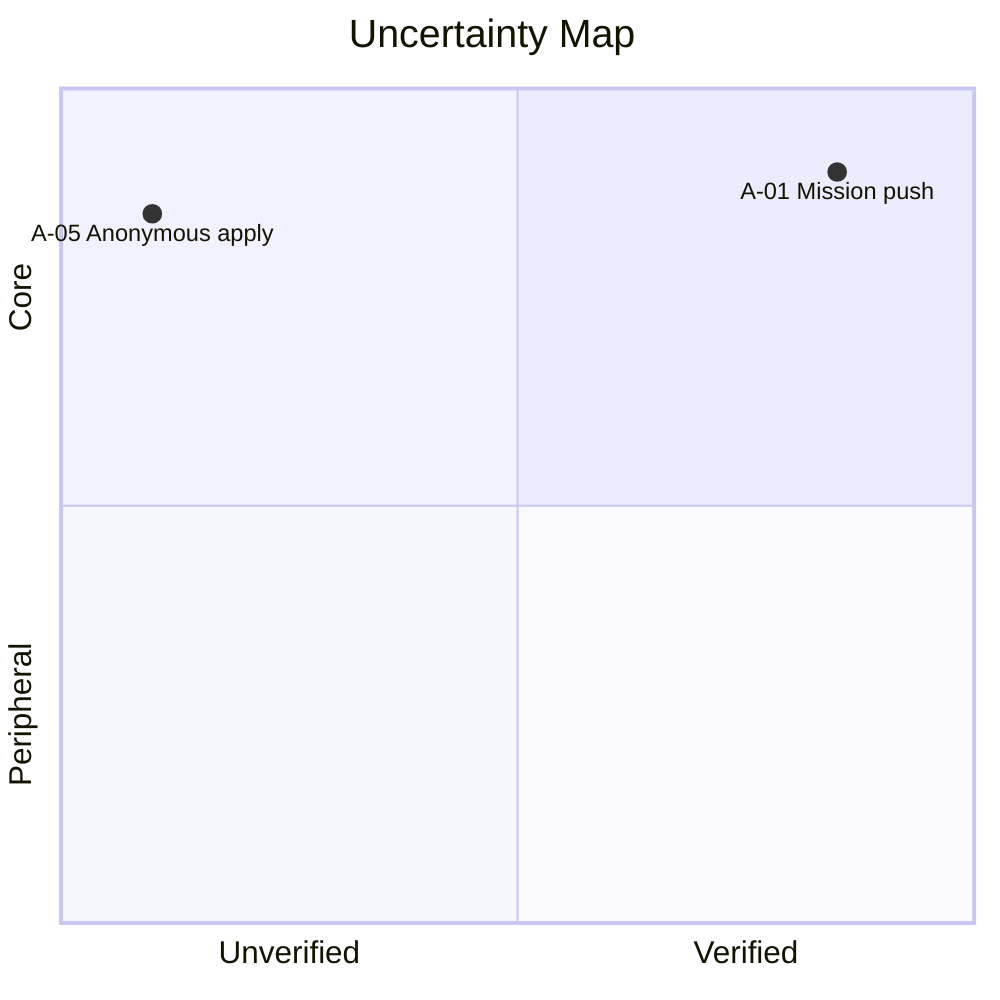

# uncertainty-map

## 概要

プロトや機能の話を渡すと（ビジョンや機能一覧、DESIGN.md があればそれを物差しにする）、各機能の暗黙の仮説を抽出し、コア / 周辺と検証度（検証済 / 部分検証 / 未検証）の 2x2 に置く。成果物は `docs/uncertainty-map.md`（Mermaid の quadrantChart、4 象限の表、次の検証アクション）。本スキルの「コア」はビジョンを成立させる仮説（Why の核）である。

## 利用メリット

- コアかつ未検証の仮説が浮かぶので、限られた検証時間を最大リスクに投下できる。
- 2x2 そのものが議論の起点になるので、別途レポートを作り直さなくてよい。
- 「実装した」と「ユーザーで確かめた」が分かれるので、動かしただけで検証済にしない。
- 価値仮説と技術仮説で手段が変わるので、「とりあえずユーザーテスト」を避けやすい。

## 利用シーン

- プロトを作り終えて、次に何を検証すべきか決めたいとき
- 「動かしてるから検証済」を防ぎたいとき
- プロト後の優先順位会議の前に、議論の起点となる図を用意したいとき

依頼の例: 「このプロトで次に何を検証すべき？」「docs/feature-list.md を起点に仮説を整理して」

## 使い方

**いつ使うか:** プロトや PBL はあるが「何を先に検証するか」が空のときに入る。`product-vision-and-concept`、`feature-backlog-map`、`prototype-design-md` のあとが多い。時期と判定は `delivery-phase-plan`、決裁者は `delivery-team-plan`。

1. ユーザーがビジョン、機能一覧、DESIGN.md、プロトのいずれかを渡す。欠落があってもスキルが 1 ターン確認して進む。
2. スキルが暗黙の前提を抽出し、コア / 周辺と検証度に分ける。差分は 1 回確認する。
3. スキルが 2x2 と検証アクションを `docs/uncertainty-map.md` にまとめる。再実行は差分更新。

## 具体例

依頼: 「社内公募アプリのプロトで次に何を検証すべき？」

::: info 出力される `docs/uncertainty-map.md` の抜粋:


```mermaid
quadrantChart
    title Uncertainty Map
    x-axis Unverified --> Verified
    y-axis Peripheral --> Core
    A-05 Anonymous apply: [0.1, 0.85]
    A-01 Mission push: [0.85, 0.9]
```

| A ID | 仮説 | 紐付 F | 軸1 根拠 | 推奨検証手段 |
|---|---|---|---|---|
| A-05 | 佐藤さんは匿名なら部署外のミッションに一歩出せる | F-02 | vision「匿名の一歩で越境が始まる」 | 2部署パイロットで手挙げ率を見る |
| ... | ... | ... | ... | ... |

:::

## 構成

```
uncertainty-map/
├── SKILL.md
├── README.md
├── templates/
│   └── docs/
│       ├── index.md               # 打ち合わせ用 Markdown の型（prhythm-docs が埋める）
│       └── sections.html          # スライド本体の型
└── references/
    ├── intake.md
    ├── assumption-extraction.md
    ├── core-vs-peripheral.md
    ├── verification-classifier.md
    ├── matrix-template.md
    ├── action-playbook.md         # 4 象限の推奨アクションと検証手段
    ├── quality-checklist.md
    ├── eval-scenarios.md
    └── eval-rubric.md
```

## 前提条件

- 必須のファイルは無い。無ければスキルが 1 ターン聞いて進む。ビジョン、機能一覧、DESIGN.md とプロト、観察ログがあればそれを使う。

## 注意事項

- ユーザー観察や計測の根拠がない限り、検証済にはしない。実装とテストのみは部分検証どまり。
- コアに置くには、ビジョンの引用か高優先度の機能紐付が必要。
- ユーザー観察人数、期間、計測値は文書から確認できないものは `—` で残す。

## 関連スキル

| スキル | 関係 |
|--------|------|
| [product-vision-and-concept](../product-vision-and-concept/README.md) | コア判定の物差しになる一行ステートメントが欲しいときに使う |
| [feature-backlog-map](../feature-backlog-map/README.md) | 機能一覧や PBL を仮説抽出の種にするとき（行き来する） |
| [prototype-design-md](../prototype-design-md/README.md) | プロト範囲（DESIGN.md）を解釈するときに使う |
| [delivery-phase-plan](../delivery-phase-plan/README.md) | コアかつ未検証を顧客向けの矢羽と Go/No-Go に載せたいときに使う |
| [delivery-team-plan](../delivery-team-plan/README.md) | 誰が決裁するかを書きたいときに使う。こちらは何を検証するか |
| [prhythm-docs](../prhythm-docs/README.md) | 出力を打ち合わせ用の Markdown と HTML にまとめたいときに使う |
