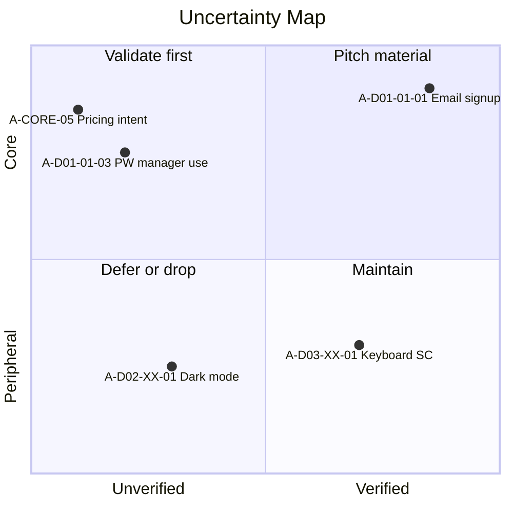

# Mode A output template — `docs/uncertainty-map.md`

Internal-use uncertainty map. Copy the structure verbatim. Fill placeholders. Do not add new top-level sections without a reason — readers expect this shape.

## Full template

````markdown
# <プロダクト名> 不確実性マップ

> 内部チーム向け。`docs/feature-list.md` の F ID と `docs/product-vision.md` のビジョンを物差しに、各機能の暗黙の仮説を 2x2 (コア/周辺 × 検証済/部分検証/未検証) で整理しています。
> 対外向けは `docs/proto-value-report.md` を参照。

## スコープ

- **ビジョン**: <一行ステートメント> （出典: `docs/product-vision.md`）
- **対象プロト**: <例: 個人ユーザーがファイル共有を始めるまでの動線>
- **入力ソース**: `docs/feature-list.md` (機能 <N> 件) + `DESIGN.md` + `git ls-files` (<M> ファイル) + 観察ログ <あり/なし>

## マトリクス



> Mermaid `quadrantChart` は GitHub・VS Code の Markdown プレビュー（v10+）でレンダリング可能。座標は 0-1 の正規化値で、x=検証進度 / y=価値の階層を表す。

ASCII 並記（プレビュー非対応環境向け）:

```text
              未検証 ─────────────────► 検証済
            ┌─────────────────┬─────────────────┐
       コア │ <n> 件          │ <n> 件          │
       価値 │ ⚠️ 最優先       │ アピール材料    │
            ├─────────────────┼─────────────────┤
       周辺 │ <n> 件          │ <n> 件          │
       価値 │ 後回し or 落とす│ メンテ          │
            └─────────────────┴─────────────────┘
```

| 象限 | 件数 | 推奨アクション |
|---|---|---|
| コア × 未検証 (⬜) | <n> | 次サイクルで検証スパイク |
| コア × 部分検証 (🟡) | <n> | ユーザー観察を追加して ✅ へ昇格 |
| コア × 検証済 (✅) | <n> | Mode B レポートで前面化 |
| 周辺 × 未検証 | <n> | コスト > 価値なら Won't 候補 |
| 周辺 × 部分検証 / 検証済 | <n> | メンテのみ |

---

## コア × 未検証 (最優先)

> 検証アクションは [action-playbook.md](../../skills/uncertainty-map/references/action-playbook.md) の 9 種カタログから選択。

| A ID | 仮説 | 紐付 F | 軸1 根拠 | 軸2 根拠 | 推奨検証手段 |
|---|---|---|---|---|---|
| A-CORE-05 | ターゲットは月額 X 円を支払う | F-D04-01 | vision「持続可能な事業として」+ Must 根拠 | 該当実装/観察なし | LP + Stripe スモークテスト |
| A-D01-01-03 | pw マネージャ利用率は十分高く忘却離脱を許容 | F-D01-01 | vision「2 分で使い始められる」起点 | 計測なし | 5 ユーザーテスト + アナリティクス |

## コア × 部分検証

| A ID | 仮説 | 紐付 F | 軸1 根拠 | 軸2 根拠 (実装/テスト) | 観察への昇格手段 |
|---|---|---|---|---|---|
| A-D01-01-02 | ロックアウト 15 分はサポート負荷許容 | F-D01-01 | vision 起点 | `src/auth/lockout.ts` + `lockout.test.ts` | β 期間中のサポートチケット計測 |

## コア × 検証済

| A ID | 仮説 | 紐付 F | 軸1 根拠 | 観察根拠 (人数/期間/結果) |
|---|---|---|---|---|
| A-D01-01-01 | ターゲットは email 登録に抵抗ない | F-D01-01 | vision「2 分で使い始められる」起点 | 5 ユーザー / 2026-06 / 完了率 100% (`docs/usability-log.md` #L23) |

## 周辺 × 未検証

| A ID | 仮説 | 紐付 F | 取扱い |
|---|---|---|---|
| A-D02-XX-01 | dark mode を好む | F-D02-XX | 検証コスト中、影響小。Phase 2 候補 |

## 周辺 × 部分検証 / 検証済

| A ID | 仮説 | 紐付 F | ステータス | 取扱い |
|---|---|---|---|---|
| A-D03-XX-01 | キーボードショートカットを覚える | F-D03-XX | 🟡 | メンテのみ |

---

## 次の検証アクション (コア未検証への対策)

> 各仮説に検証手段 / 必要工数 / 期待結果 / 失格条件を 1 行で。

| A ID | 検証手段 | 必要工数 | 期待結果 | 失格条件 |
|---|---|---|---|---|
| A-CORE-05 | LP + Stripe スモークテスト | 5 日 | CVR 3% 以上 | CVR 1% 未満 |
| A-D01-01-03 | 5 ユーザーテスト + アナリティクス | 3 日 | 完了率 80% 以上 | 完了率 50% 未満 |

棄却された仮説:

| A ID | 仮説 | 棄却理由 |
|---|---|---|
| (取下げ) | コラボ機能を即座に使い始める | vision に該当語なし、Must にも未紐付 |

---

## カバレッジ・サマリ

| 項目 | 値 |
|---|---|
| 全 assumption | <N> |
| コア / 周辺 | <c> / <p> |
| ✅ / 🟡 / ⬜ | <v> / <pp> / <u> |
| Must 機能カバー | <covered>/<total Must> |
| 観察ログ参照件数 | <ref count> |

未カバー Must がある場合は理由（assumption 抽出待ち / Won't）を明記。

---

## 次の一手

- 検証スパイク実行 → 結果で Mode A を再生成
- 対外向けレポートが必要なら → `/uncertainty-map Mode B`
- 検証で構造変化があれば → `/feature-backlog-mapper` で Must を再判定
````

## Required sections

Verify before emit:

1. **スコープ** — vision + 対象プロト + 入力ソース
2. **マトリクス** — ASCII 図 + 象限別件数 + 推奨アクション表
3. **4 象限の詳細表** — コア × {未検証 / 部分検証 / 検証済} + 周辺 × {未検証 / 部分検証または検証済}
4. **次の検証アクション** — 検証手段 / 工数 / 期待結果 / 失格条件
5. **カバレッジ・サマリ** — 数値で

## Anti-patterns

| Anti-pattern | Fix |
|--------------|-----|
| マトリクス図が無く表だけ | ASCII 図を入れる（一目で見える） |
| 「次の検証アクション」に手段だけ | 工数 + 期待結果 + 失格条件を必ず添える |
| カバレッジ・サマリの数値が numerator のみ | denominator を併記 |
| Won't 相当が本表に混在 | 棄却された仮説サブセクションへ移動 |
| 観察根拠なしの ✅ | [verification-classifier.md](verification-classifier.md) §Promotion rules を参照して 🟡 に降格 |
