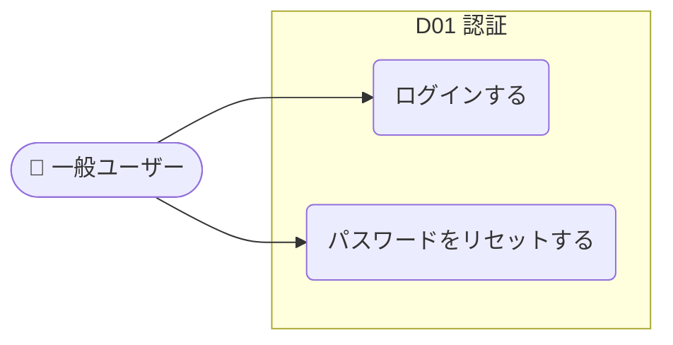

# usecase-mapper

> プロジェクトの **ユースケース一覧** と **ユースケース図** を生成するエージェントスキル。

コードベース・仕様書・要件・議事録などを分析し、「誰（アクター）が・何を達成できるか（ユースケース）」を一望できるマップを `docs/usecase-map.md` に出力します。新規参画者のオンボーディングや、機能の棚卸し・全体像把握に使えます。

---

## 何を生成するか

`docs/usecase-map.md` に以下を出力します。

| 出力 | 内容 |
|---|---|
| **システム概要** | アクター一覧 / ドメイン概要一覧 |
| **ユースケース一覧** | 全ドメイン横断の表（`UC ID / ユースケース / アクター / ドメイン / 状態 / 関連API・画面`） |
| **全体ユースケース図** | アクター × ドメインの俯瞰図（Mermaid） |
| **ドメインごとの詳細** | ユースケース図 + フロー図 + アクティビティ表（API・画面への対応） |

すべて Mermaid + Markdown のため、GitHub や VS Code でそのまま閲覧できます。

## 使い方

Claude Code 上で以下のように依頼すると起動します。

```
ユースケース図を生成して
ユースケース一覧が欲しい
このプロジェクトの全体像を把握したい
```

入力ソース（コード／仕様書など）が複数ある場合や場所が特殊な場合は、依頼時に対象を伝えてください。

```
docs/spec.md と apps/ のコードからユースケースマップを作って
```

## 入力（複数ソース対応）

ソースコードだけでなく、以下を単独・複数組み合わせて入力にできます。

| 入力種別 | 例 | 主に埋まる情報 |
|---|---|---|
| ソースコード | `apps/`, `packages/` | ユースケース・アクター・API・画面（実装由来で確実） |
| 仕様書 / 設計書 | `docs/spec.md`, Notion, PDF | ユースケース・アクター・画面名・ドメイン区分 |
| 要件定義 | 要求一覧、ユーザーストーリー | アクター・ユースケース・目的 |
| 議事録 / メモ | MTG メモ、ヒアリング記録 | アクター・想定ユースケース（粒度は粗め） |

**大原則: 推測で埋めない。** 文書だけでは確定できない API・画面などのセルは `—`（空欄）にします。実装で確認できたものは `実装済`、文書のみで未確認のものは `未実装` として「状態」列で区別します。

## 出力例（抜粋）

ユースケース一覧:

| UC ID | ユースケース | アクター | ドメイン | 状態 | 関連API/画面 |
|---|---|---|---|---|---|
| UC-D01-02 | ログインする | 一般ユーザー | D01 認証 | 実装済 | `POST /auth/login` / `/login` |
| UC-D05-03 | LINE で通知を受け取る | 一般ユーザー | D05 通知 | 未実装 | — |

ユースケース図（Mermaid）:



## ユースケース図の表現について

Mermaid には正式な UML ユースケース図記法が**まだ無い**（[mermaid-js/mermaid#4628](https://github.com/mermaid-js/mermaid/issues/4628) は承認済だが未リリース）ため、GitHub の Markdown でそのままレンダリングできる `flowchart` で近似表現しています。PlantUML は GitHub Markdown では描画されないため採用していません。

- アクター: `名前([👤 アクター名])`（スタジアム型）
- ユースケース: `id(〇〇する)`（丸型）／ 未実装は破線ノード `id(〇〇する):::planned`
- システム境界: `subgraph` で囲む

## 動作環境・前提

- Claude Code（プラグイン `prhythm` の一部として配布）
- 出力された Mermaid 図の閲覧には GitHub、または VS Code の Markdown Preview（Mermaid 対応拡張）を推奨

## ファイル構成

```
usecase-mapper/
├── SKILL.md     # エージェントが実行する手順・出力仕様（モデルが読む本体）
└── README.md    # 本ドキュメント（人間向けの概要・使い方）
```
