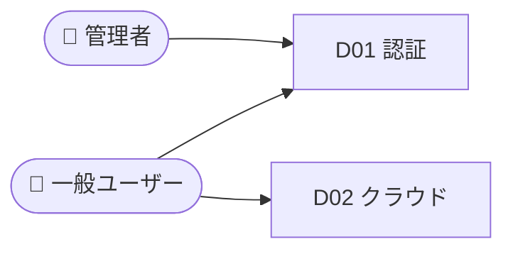
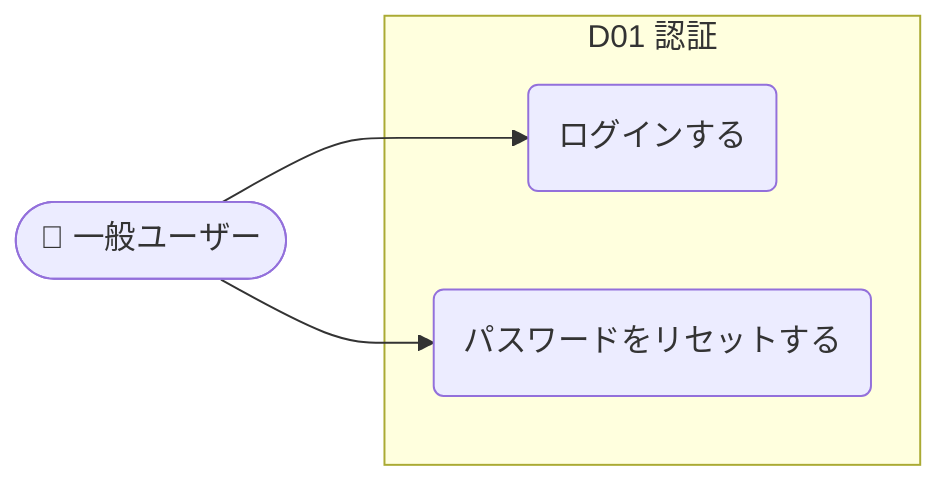

# ユースケースマップ生成

コードベースを分析し、ユースケース（アクターが達成する目的単位の操作）中心のマップを `docs/usecase-map.md` に生成する。ユースケース一覧・ユースケース図を主役に、ドメイン単位の API・画面・フロー図を併記する。

> 出力イメージは [`examples/usecase-map.sample.md`](examples/usecase-map.sample.md)（架空プロダクト「TripMate」のサンプル）を参照。

---

## Step 0: 入力ソースの確定

入力は**ソースコードに限らない**。以下が単独または複数組み合わさって与えられる:

| 入力種別 | 例 | 主に埋まる情報 |
|---|---|---|
| ソースコード | `apps/bff/`, `apps/web/`, `packages/drizzle/` | ユースケース・アクター・メソッド・エンドポイント・画面パス（実装由来で確実） |
| 仕様書 / 設計書 | `docs/spec.md`, Notion, PDF | ユースケース・アクター・画面名・ドメイン区分 |
| 要件定義 | 要求一覧、ユーザーストーリー | アクター・ユースケース・目的 |
| 議事録 / メモ | MTG メモ、ヒアリング記録 | アクター・想定ユースケース（粒度が粗いことが多い） |

ユーザー指示・引数・リポジトリ内のドキュメントから**今回の入力ソースを特定**し、種別に応じて Step 1 の収集方法を選ぶ。
入力が文書のみ（コード無し）の場合は Step 1 の Explore をスキップし、Read/Grep で文書を読み込んで抽出する。

> **大原則: 推測で埋めない。実装が分からない欄は空欄にする。**
> 文書だけでは API メソッド・エンドポイント・画面パスなどが確定できないことが多い。
> その場合、確定できないセルは `—`（ダッシュ）にして空欄とし、捏造しない。
> 「文書に書かれていること」と「実装を見ないと分からないこと」を必ず区別する。

## Step 1: 入力ソースの分析

### ソースコードがある場合（Explore エージェント × 3 並列）

以下の 3 つの Explore エージェントを **並列** で起動する:

| エージェント | 探索対象 | 収集する情報 |
|---|---|---|
| BFF ドメイン分析 | `apps/bff/src/interface/routes/`, `apps/bff/src/usecase/` | 各エンドポイントの HTTP メソッド・パス・ファイルパス・所属ドメイン・**ユースケース（=何をする操作か）・そのユースケースを起動するアクター** |
| Web 画面分析 | `apps/web/src/routes/` | 画面パス・画面名・レイアウト構造・**画面から起動できるユースケース** |
| ドメインモデル分析 | `packages/drizzle/src/schema/`, `apps/bff/src/domain/` | 主要エンティティ名・各ドメインが操作するエンティティ |

> 探索対象パスはプロジェクト構成に合わせて読み替える。モノレポ以外なら `src/` 等を対象にする。

### 仕様書・要件・議事録など文書がある場合

Read / Grep で対象文書を読み込み、以下を抽出する:
- **アクター**: 「ユーザー」「管理者」「〜担当」など登場人物・役割
- **ユースケース**: 「〜できる」「〜する」と書かれた機能・要求を目的単位に正規化
- **ドメイン区分**: 章立て・機能カテゴリから推定
- 画面名・API は文書に明記があれば採用、無ければ**空欄（`—`）のまま**にする

### 入力が複数ある場合（コード＋文書）

コードと文書の両方がある場合は両方を分析し、**マージ**する:
- コードで確認できたユースケースは実装由来として API/画面を埋める
- 文書にしか無いユースケース（未実装・将来要件）は API/画面を空欄にし、後述の「状態」列で `未実装` と示す
- 矛盾があればコード（実装）を正とし、差分はキーポイントに注記する

> **ユースケースの抽出方針**: ユースケース = 「アクターがシステムを使って達成する目的単位の操作」。
> コードならユースケースファイルの各ハンドラ・ルート・画面アクション、文書なら「〜できる」要求を
> 「〇〇する」という動詞句に正規化して抽出する（例: `POST /auth/login` → 「ログインする」）。
> CRUD の細かい差ではなく、利用者の目的単位でまとめる。各ユースケースに必ず**アクター**を紐づける。

## Step 2: ユースケースマップ生成

分析結果をもとに `docs/usecase-map.md` を Write で生成する。

**出力構成:**

```markdown
# <プロダクト名> ユースケースマップ

> 新規参画者向け。各ドメインは折りたたまれています。
> 担当ドメインのセクションを開いて読み始めてください。

## システム概要
- アクター一覧（5行の表）
- ドメイン概要一覧表（ID / ドメイン名 / 一行説明 / 主要画面）

## ユースケース一覧
（全ドメイン横断のユースケース一覧表。アクティビティ表の「ユースケース」列をここに集約する）

| UC ID | ユースケース | アクター | ドメイン | 状態 | 関連API/画面 |
|---|---|---|---|---|---|
| UC-D01-01 | ログインする | 一般ユーザー | D01 認証 | 実装済 | `POST /auth/login` / `/login` |
| UC-D01-02 | パスワードをリセットする | 一般ユーザー | D01 認証 | 未実装 | — |
| ... | ... | ... | ... | ... | ... |

- UC ID は `UC-<ドメインID>-<連番>` で採番する
- ドメイン詳細セクション内のアクティビティ表の「ユースケース」列と UC ID で対応づける
- **状態**: 実装を確認できたら `実装済`、文書のみで実装未確認なら `未実装`、判断不能なら空欄（`—`）
- 実装が分からず埋められないセルは**推測せず `—`** にする（捏造禁止）

## 全体ユースケース図
（アクターとドメイン（ユースケースのまとまり）の関係を俯瞰する1枚。詳細は各ドメインの図に委ねる）



---

<details>
<summary>D01 認証 — メール・パスワード認証、SAML SSO、デスクトップアプリ認証</summary>

（2-3行の機能説明: このドメインが「誰のために」「何をする」機能なのかを簡潔に記述。
技術スタックや特徴的な実装ポイントにも軽く触れる。）

### ユースケース図
（このドメインの「アクター」と「ユースケース」の関係を図示。下のアクティビティ表の各行が1ユースケースに対応する）



### フロー
（Mermaid flowchart: 主要フローを5-8ノードで簡潔に図示）

### アクティビティ（ユースケース）→ API → 画面
| # | UC ID | ユースケース | アクター | メソッド | エンドポイント | 画面パス | 画面名 | 状態 |
|---|---|---|---|---|---|---|---|---|

（実装を確認できないメソッド・エンドポイント・画面パス・画面名のセルは `—` で空欄にする。状態は 実装済 / 未実装 / `—`）

### キーポイント
- 1-2行の補足（クレジット消費、権限、注意点など）

</details>

<details>
<summary>D02 クラウド — ...</summary>
...
</details>

...D03〜D08 同様...
```

### ドメインの分類基準

コードベースの分析結果から、以下の観点でドメインを識別・分類する:
- BFF のルートディレクトリ構成（ドメイン単位で分かれている）
- ユースケースファイルの機能グループ
- Web の画面パス構成

### Mermaid フロー図のルール

- 各ドメインにつき **1図、5〜8ノード** に収める（主要フローのみ）
- 高コントラスト配色: 青 `#1565c0`、緑 `#2e7d32`、赤 `#c62828`、橙 `#e65100`（白文字）
- フロー図の目的は「このドメインが何をするか」を30秒で把握すること

### ユースケース図のルール

- Mermaid には専用のユースケース図記法がないため `flowchart LR` で表現する
- **アクター**は `名前([👤 アクター名])` のスタジアム型、**ユースケース**は `id(〇〇する)` の丸型ノードで表す
- ユースケース群は `subgraph D0x[ドメイン名]` でシステム境界として囲む
- アクター → ユースケース を実線 `-->` で結ぶ。複数アクターが同一ユースケースを使う場合は両方から線を引く
- include / extend 関係がある場合のみ点線で `uc1 -. include .-> uc2` のように補足（無理に作らない）
- 1ドメインあたりのユースケースが多い場合は主要 6〜10 個に絞り、残りは表で網羅する
- 全体ユースケース図はアクター × ドメイン粒度に留め、ノードが増えすぎないようにする
- **未実装（文書のみ）のユースケース**は破線ノード `uc1(〇〇する):::planned` で区別する（`classDef planned stroke-dasharray:4` を定義）。実装状態が不明なら通常ノードのままにする

## Step 3: ユーザーへの案内

生成完了後、以下を表示する:

```
📄 docs/usecase-map.md にユースケースマップを生成しました。

- 「ユースケース一覧」で全機能を俯瞰 → 「全体ユースケース図」でアクターとの関係を把握できます
- まず担当ドメインのセクション（D01〜D08）を開いて読むのがおすすめです（各ドメインにユースケース図あり）
- Mermaid 図（フロー図・ユースケース図）は VS Code の Markdown Preview Enhanced や GitHub で表示できます
- 詳細な API 仕様は BFF のルートファイルを直接参照してください
- このファイルは .gitignore 対象です（各自の環境で生成）
```
