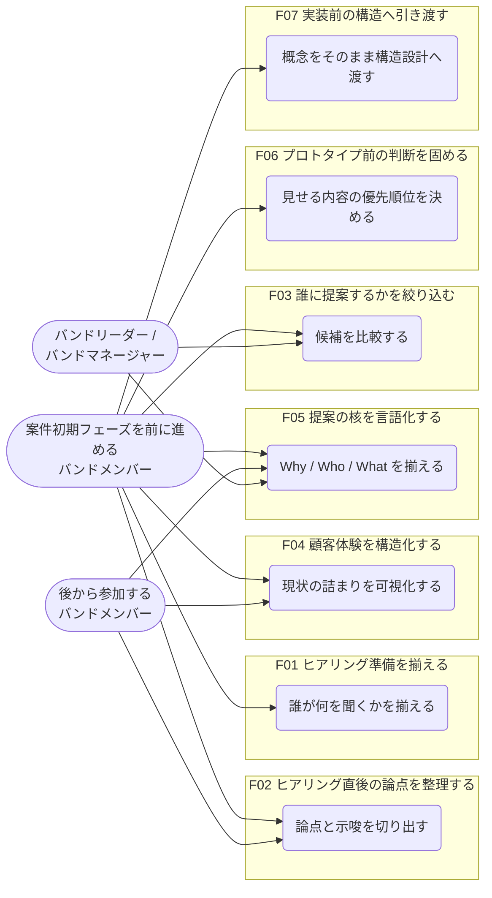
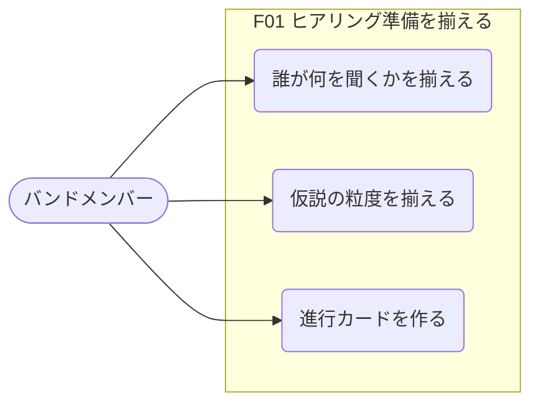

# usecase-mapper 実出力例

## テスト入力

- 入力ソース:
  - `docs/prhythm-band-persona-stage1.md`
  - `docs/prhythm-band-persona-stage2.md`
- モード:
  - 全体俯瞰
- 対象 Persona:
  - 案件初期フェーズを前に進めるバンドメンバー

## アクター、ペルソナ一覧

| Actor / Persona | 概要 | 主な状況 | 主な目的 |
|---|---|---|---|
| 案件初期フェーズを前に進めるバンドメンバー | 既存バンドの一員として、顧客理解から提案整理までを担う主役 | ヒアリング前後、提案整理、体験整理、プロトタイプ前判断 | 案件初期の判断を属人化させず前進させる |
| 後から参加するバンドメンバー | 途中から案件に入る読み手・共同作業者 | 既存の整理物を読んで文脈を追う場面 | いま何が決まっていて、次に何をすべきかを追える |
| バンドリーダー / バンドマネージャー | 推進責任を持ち、成果物の整合性を気にする周辺 Actor | 提案品質や進め方を均したい場面 | バンド全体で筋の通った進め方を維持する |

## 機能一覧

| 機能ID | 機能名 | 何を可能にするか | 主な対象 Actor | 代表ユースケース数 |
|---|---|---|---|---|
| F01 | ヒアリング準備を揃える | バンドで何を聞き、どこまで仮説を持って入るかを揃えられる | バンドメンバー | 3 |
| F02 | ヒアリング直後の論点を整理する | 発言ログを次の判断につながる論点へ変換できる | バンドメンバー | 3 |
| F03 | 誰に提案するかを絞り込む | 主対象の利用者や役割を比較し、提案先を狭められる | バンドメンバー、バンドリーダー | 3 |
| F04 | 顧客体験を構造化する | 現状の詰まりと理想の流れを、チームで同じ絵として持てる | バンドメンバー | 3 |
| F05 | 提案の核を言語化する | Why / Who / What を揃え、説明する人ごとの差を減らせる | バンドメンバー、バンドリーダー | 3 |
| F06 | プロトタイプ前の判断を固める | UI を作る前に、何を見せるか・何を避けるかを決められる | バンドメンバー | 2 |
| F07 | 実装前の構造へ引き渡す | 上流で決めた言葉を、実装前の構造設計へつなげられる | バンドメンバー、実装接続を担うメンバー | 2 |

## ユースケース一覧

| UC ID | 機能ID | 機能名 | ユースケース | 主アクター | 利用シーン | 期待結果 | 確度 |
|---|---|---|---|---|---|---|---|
| UC-F01-01 | F01 | ヒアリング準備を揃える | 誰が何を聞くかを揃える | バンドメンバー | 顧客ヒアリング前 | 役割と質問の重複が減る | Assumption |
| UC-F01-02 | F01 | ヒアリング準備を揃える | 仮説の粒度を揃える | バンドメンバー | 事前準備のすり合わせ | 会話で検証したい点が明確になる | Assumption |
| UC-F01-03 | F01 | ヒアリング準備を揃える | 進行カードを作る | バンドメンバー | ヒアリング直前 | 会話の進行が散らからない | Assumption |
| UC-F02-01 | F02 | ヒアリング直後の論点を整理する | 論点と示唆を切り出す | バンドメンバー | ヒアリング直後 | 次に判断すべき論点が残る | Assumption |
| UC-F02-02 | F02 | ヒアリング直後の論点を整理する | 次回確認事項を残す | バンドメンバー | 次回接点の準備 | 確認漏れを減らせる | Assumption |
| UC-F02-03 | F02 | ヒアリング直後の論点を整理する | 共有可能な整理物にする | 後から参加するバンドメンバー | 途中参加時 | 文脈を追いやすくなる | Assumption |
| UC-F03-01 | F03 | 誰に提案するかを絞り込む | 候補を比較する | バンドメンバー | Persona 検討時 | 誰向けの提案かを絞れる | Assumption |
| UC-F03-02 | F03 | 誰に提案するかを絞り込む | Counter-persona を置く | バンドメンバー、バンドリーダー | 対象外を決める場面 | 提案範囲が広がりすぎない | Assumption |
| UC-F03-03 | F03 | 誰に提案するかを絞り込む | Primary の判断材料を揃える | バンドリーダー / バンドマネージャー | 方針決定前 | 推進判断に使える材料が揃う | Assumption |
| UC-F04-01 | F04 | 顧客体験を構造化する | 現状の詰まりを可視化する | バンドメンバー | 体験整理時 | 課題の位置が共有される | Assumption |
| UC-F04-02 | F04 | 顧客体験を構造化する | 理想の流れを描く | バンドメンバー | 提案方向を考える場面 | 目指す体験の仮説が揃う | Assumption |
| UC-F04-03 | F04 | 顧客体験を構造化する | 中心シーンを選ぶ | バンドメンバー | スコープ整理時 | どの場面を優先するか決まる | Assumption |
| UC-F05-01 | F05 | 提案の核を言語化する | Why / Who / What を揃える | バンドメンバー、バンドリーダー | 提案整理時 | 提案の核が一文で説明できる | Assumption |
| UC-F05-02 | F05 | 提案の核を言語化する | 提案の一文を作る | バンドメンバー、バンドリーダー | 社内外説明前 | 説明のブレが減る | Assumption |
| UC-F05-03 | F05 | 提案の核を言語化する | 後続に渡す共通言語を残す | バンドメンバー | 後続工程への引き渡し | 設計やプロトタイプに接続しやすい | Assumption |
| UC-F06-01 | F06 | プロトタイプ前の判断を固める | 見せる内容の優先順位を決める | バンドメンバー | プロトタイプ前 | 作るべきものを絞れる | Assumption |
| UC-F06-02 | F06 | プロトタイプ前の判断を固める | 禁止事項や避ける表現を揃える | バンドメンバー | 表現検討時 | 誤った印象を避けられる | Assumption |
| UC-F07-01 | F07 | 実装前の構造へ引き渡す | 概念をそのまま構造設計へ渡す | バンドメンバー、実装接続を担うメンバー | 実装前整理 | 上流の言葉が設計で失われにくい | Assumption |
| UC-F07-02 | F07 | 実装前の構造へ引き渡す | 必要な案件だけ後段スキルを追加する | バンドメンバー | 次の作業を選ぶ場面 | 過剰に詳細化せず進められる | Assumption |

## 全体のユースケース図

## 機能ごとのユースケース図

### F01 ヒアリング準備を揃える

#### 機能の簡単な説明

顧客と話す前に、バンド内で聞くこと、持ち込む仮説、進行の役割を揃える機能。

#### ユースケース図本体

### F02 ヒアリング直後の論点を整理する

#### 機能の簡単な説明

ヒアリング内容を、発言ログのままにせず、次に判断すべき論点や示唆として整理する機能。

#### ユースケース図本体

### F03 誰に提案するかを絞り込む

#### 機能の簡単な説明

複数の利用者候補を比較し、Primary persona と対象外にする Counter-persona を置いて提案先を絞る機能。

#### ユースケース図本体

### F04 顧客体験を構造化する

#### 機能の簡単な説明

現状の体験で詰まっている箇所と、理想の流れを同じ絵で持ち、提案で扱う中心シーンを選ぶ機能。

#### ユースケース図本体

### F05 提案の核を言語化する

#### 機能の簡単な説明

Why、Who、What を揃え、誰が説明しても提案の核がずれないように共通言語へ落とす機能。

#### ユースケース図本体

### F06 プロトタイプ前の判断を固める

#### 機能の簡単な説明

プロトタイプに入る前に、何を見せるか、何を見せないか、避ける表現は何かを決める機能。

#### ユースケース図本体

### F07 実装前の構造へ引き渡す

#### 機能の簡単な説明

上流で決めた概念や言葉を、後続の構造設計や実装前整理に失われない形で渡す機能。

#### ユースケース図本体

## このテストで確認できたこと

- Persona から機能一覧へ落とす流れで、コードなしでも出力が成立する
- Mermaid の `flowchart LR` でも、ユースケース図っぽい全体俯瞰と機能別詳細は表現できる
- 出力順を `アクター、ペルソナ一覧`、`機能一覧`、`ユースケース一覧`、`全体のユースケース図`、`機能ごとのユースケース図` に固定できる
