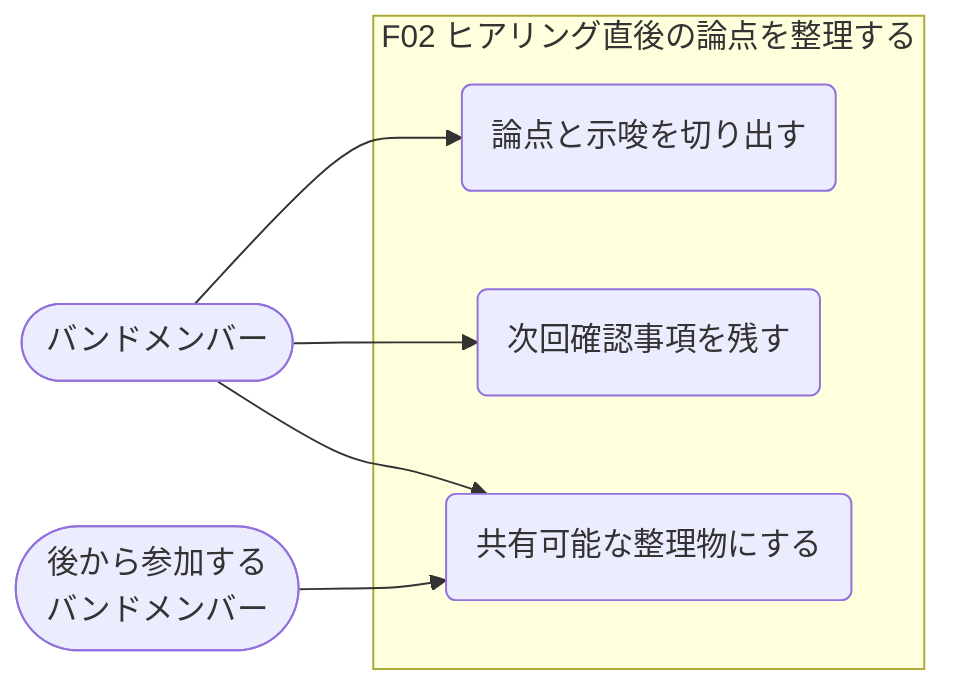
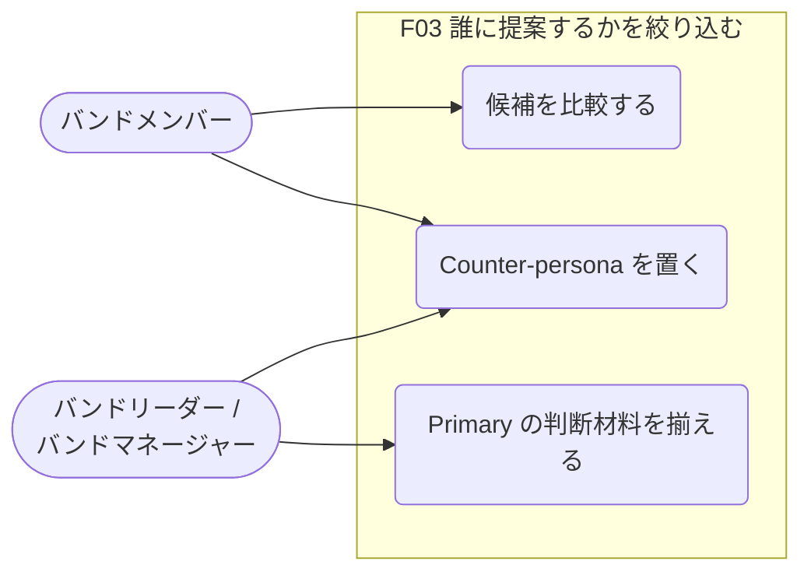
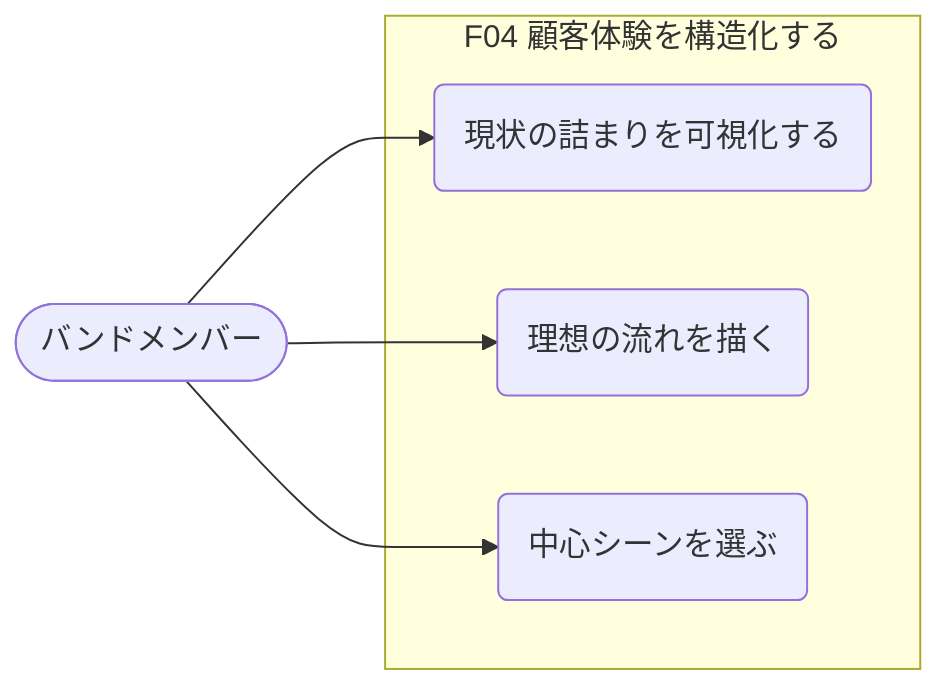
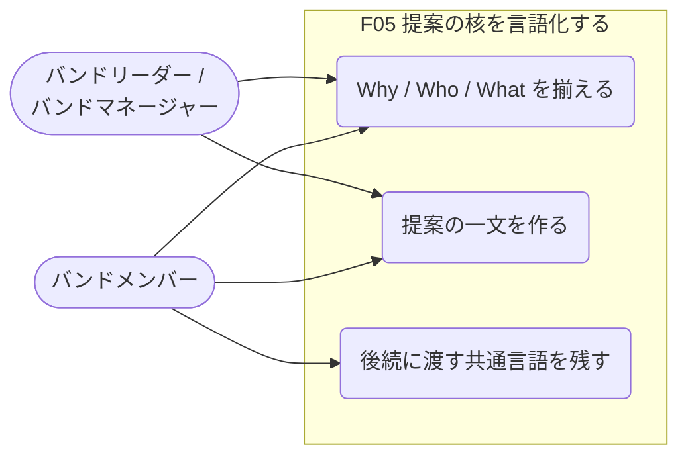
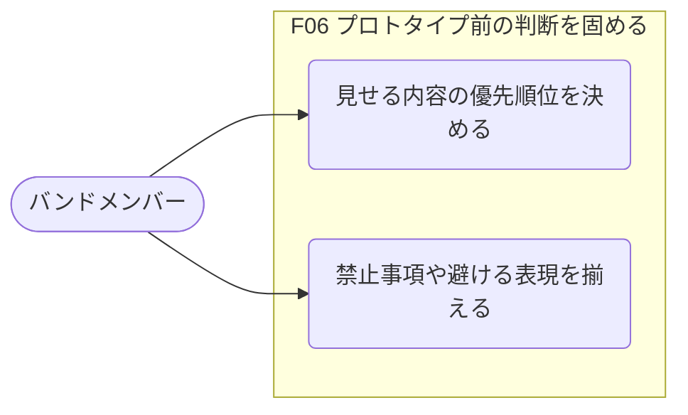
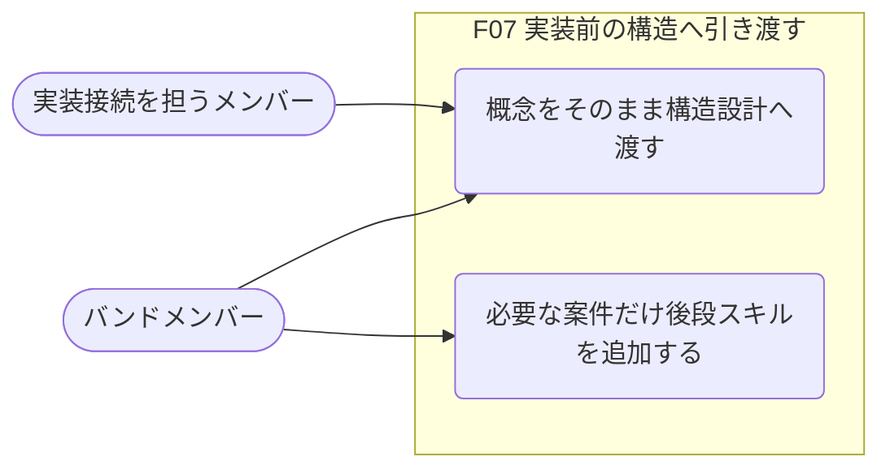

# usecase-mapper 実出力例

## テスト入力

- 入力ソース:
  - `docs/prhythm-band-persona-stage1.md`
  - `docs/prhythm-band-persona-stage2.md`
- モード:
  - 全体俯瞰
- 対象 Persona:
  - 案件初期フェーズを前に進めるバンドメンバー

## 実際に出した Mermaid 出力

一覧は補助です。まず図を見ます。

### 全体ユースケース図

## 機能別ユースケース図

### F01 ヒアリング準備を揃える

### F02 ヒアリング直後の論点を整理する

### F03 誰に提案するかを絞り込む

### F04 顧客体験を構造化する

### F05 提案の核を言語化する

### F06 プロトタイプ前の判断を固める

### F07 実装前の構造へ引き渡す

## 補助情報

### Actor / Persona 一覧

| Actor | 概要 | 主な状況 | 主な目的 |
|---|---|---|---|
| 案件初期フェーズを前に進めるバンドメンバー | 既存バンドの一員として、顧客理解から提案整理までを担う主役 | ヒアリング前後、提案整理、体験整理、プロトタイプ前判断 | 案件初期の判断を属人化させず前進させる |
| 後から参加するバンドメンバー | 途中から案件に入る読み手・共同作業者 | 既存の整理物を読んで文脈を追う場面 | いま何が決まっていて、次に何をすべきかを追える |
| バンドリーダー / バンドマネージャー | 推進責任を持ち、成果物の整合性を気にする周辺 Actor | 提案品質や進め方を均したい場面 | バンド全体で筋の通った進め方を維持する |

### 機能一覧

| 機能ID | 機能名 | 何を可能にするか | 主な対象 Actor | 代表ユースケース数 |
|---|---|---|---|---|
| F01 | ヒアリング準備を揃える | バンドで何を聞き、どこまで仮説を持って入るかを揃えられる | バンドメンバー | 3 |
| F02 | ヒアリング直後の論点を整理する | 発言ログを次の判断につながる論点へ変換できる | バンドメンバー | 3 |
| F03 | 誰に提案するかを絞り込む | 主対象の利用者や役割を比較し、提案先を狭められる | バンドメンバー、バンドリーダー | 3 |
| F04 | 顧客体験を構造化する | 現状の詰まりと理想の流れを、チームで同じ絵として持てる | バンドメンバー | 3 |
| F05 | 提案の核を言語化する | Why / Who / What を揃え、説明する人ごとの差を減らせる | バンドメンバー、バンドリーダー | 3 |
| F06 | プロトタイプ前の判断を固める | UI を作る前に、何を見せるか・何を避けるかを決められる | バンドメンバー | 2 |
| F07 | 実装前の構造へ引き渡す | 上流で決めた言葉を、実装前の構造設計へつなげられる | バンドメンバー、実装接続を担うメンバー | 2 |

## このテストで確認できたこと

- Persona から機能一覧へ落とす流れで、コードなしでも出力が成立する
- Mermaid の `flowchart LR` でも、ユースケース図っぽい全体俯瞰と機能別詳細は十分表現できる
- 一覧表は補助に回して、図を先に置く構成のほうが意図に合う
