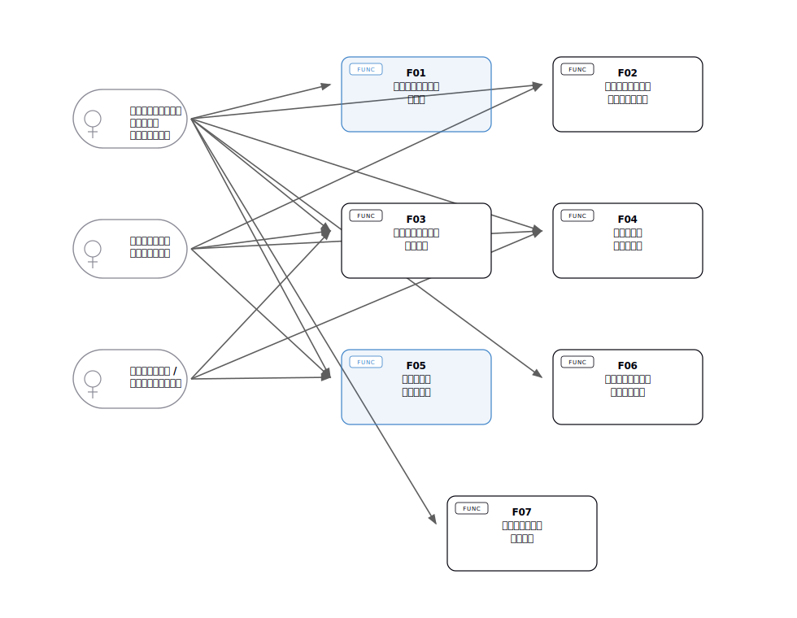
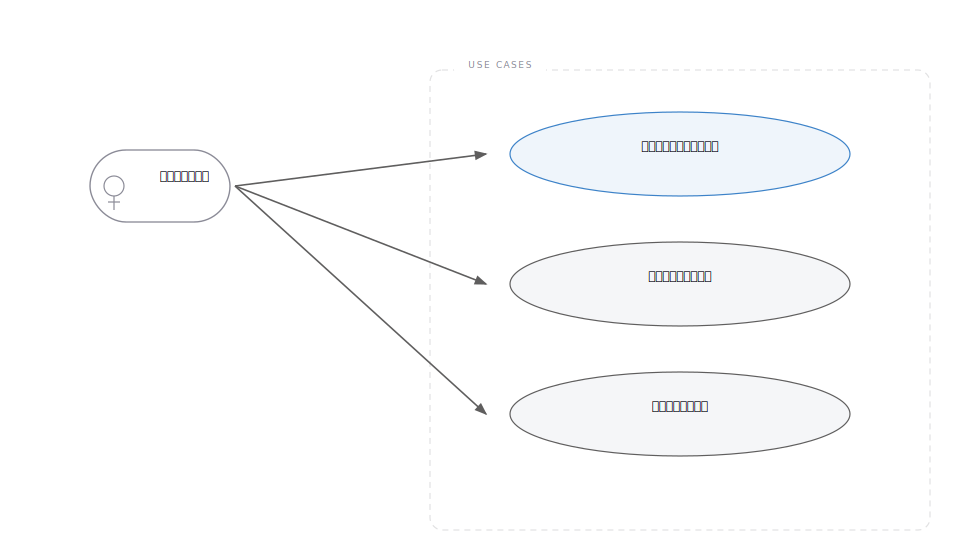
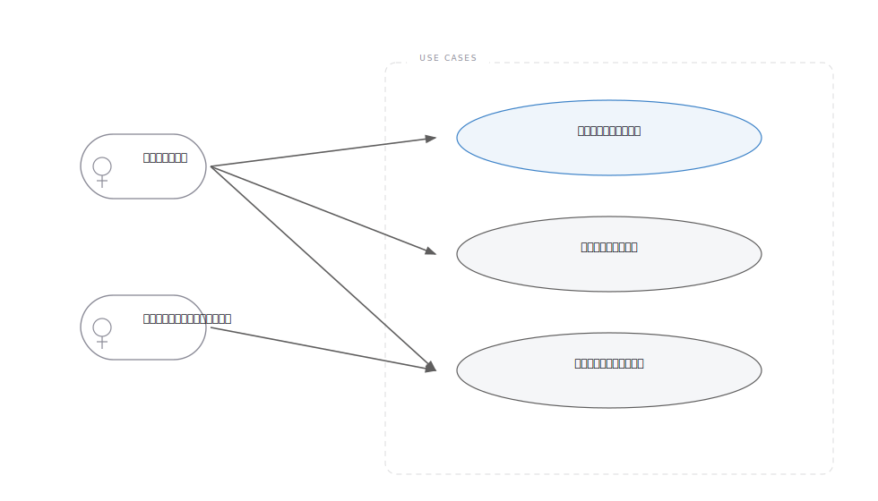
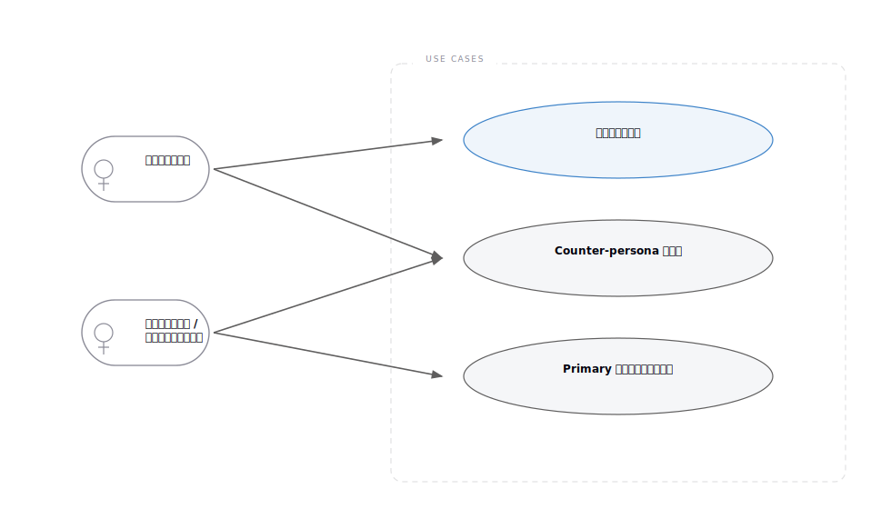
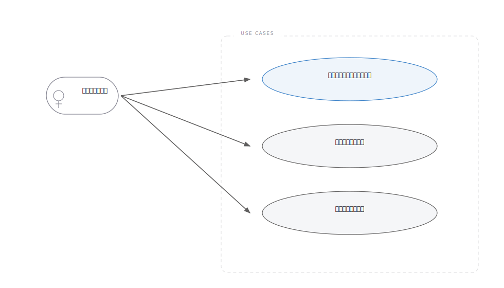
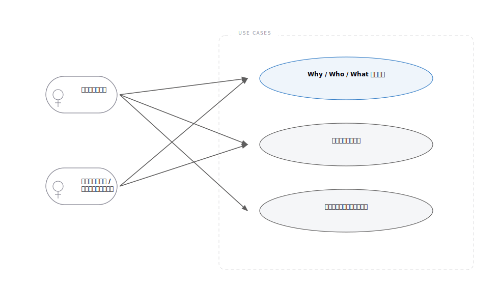
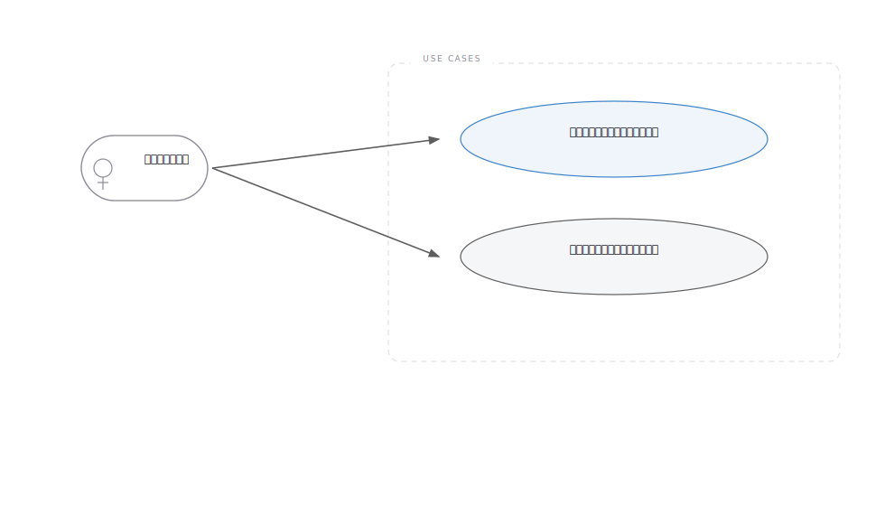
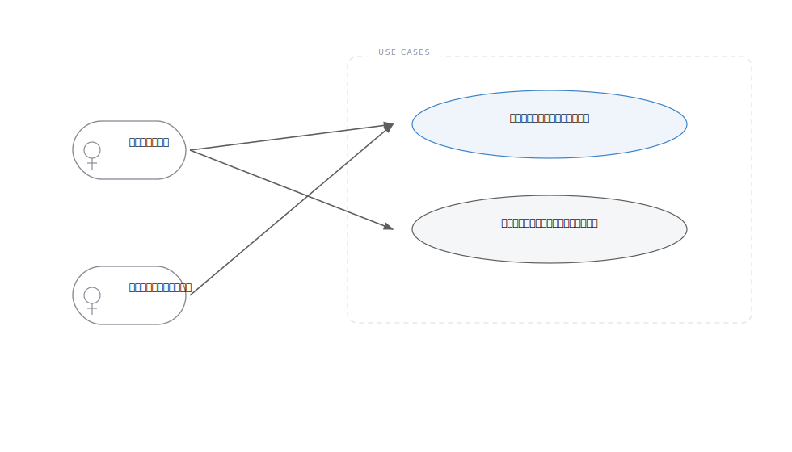

# usecase-mapper 実出力例

## テスト入力

- 入力ソース:
  - `docs/prhythm-band-persona-stage1.md`
  - `docs/prhythm-band-persona-stage2.md`
- モード:
  - 全体俯瞰
- 対象 Persona:
  - 案件初期フェーズを前に進めるバンドメンバー

## 実際に出した出力

### 全体ユースケース図

### Actor / Persona 一覧

| Actor | 概要 | 主な状況 | 主な目的 |
|---|---|---|---|
| 案件初期フェーズを前に進めるバンドメンバー | 既存バンドの一員として、顧客理解から提案整理までを担う主役 | ヒアリング前後、提案整理、体験整理、プロトタイプ前判断 | 案件初期の判断を属人化させず前進させる |
| 後から参加するバンドメンバー | 途中から案件に入る読み手・共同作業者 | 既存の整理物を読んで文脈を追う場面 | いま何が決まっていて、次に何をすべきかを追える |
| バンドリーダー / バンドマネージャー | 推進責任を持ち、成果物の整合性を気にする周辺 Actor | 提案品質や進め方を均したい場面 | バンド全体で筋の通った進め方を維持する |

### 機能一覧

| 機能ID | 機能名 | 何を可能にするか | 主な対象 Actor | 代表ユースケース数 |
|---|---|---|---|---|
| F01 | ヒアリング準備を揃える | バンドで何を聞き、どこまで仮説を持って入るかを揃えられる | バンドメンバー | 3 |
| F02 | ヒアリング直後の論点を整理する | 発言ログを次の判断につながる論点へ変換できる | バンドメンバー | 3 |
| F03 | 誰に提案するかを絞り込む | 主対象の利用者や役割を比較し、提案先を狭められる | バンドメンバー、バンドリーダー | 3 |
| F04 | 顧客体験を構造化する | 現状の詰まりと理想の流れを、チームで同じ絵として持てる | バンドメンバー | 3 |
| F05 | 提案の核を言語化する | Why / Who / What を揃え、説明する人ごとの差を減らせる | バンドメンバー、バンドリーダー | 3 |
| F06 | プロトタイプ前の判断を固める | UI を作る前に、何を見せるか・何を避けるかを決められる | バンドメンバー | 2 |
| F07 | 実装前の構造へ引き渡す | 上流で決めた言葉を、実装前の構造設計へつなげられる | バンドメンバー、実装接続を担うメンバー | 2 |

### ユースケース一覧の一部

| UC ID | 機能ID | ユースケース | 主アクター | 利用シーン | 期待結果 | 確度 |
|---|---|---|---|---|---|---|
| UC-F01-01 | F01 | バンドで誰が何を聞くかを揃えられる | バンドメンバー | ヒアリング前日 | 当日の役割分担が曖昧なまま始まらない | Fact |
| UC-F02-01 | F02 | 発言ログから論点と示唆を切り出せる | バンドメンバー | ヒアリング直後 | 議事録だけ残って終わらない | Fact |
| UC-F03-02 | F03 | Counter-persona を含めて設計の境界を確認できる | バンドメンバー、バンドリーダー | 誰を捨てるかも含めて議論したい場面 | 最適化の境界が見える | Assumption |
| UC-F05-01 | F05 | Why / Who / What を一貫した形で言語化できる | バンドメンバー | 提案の方向性を整理する場面 | 説明する人ごとの差が減る | Fact |
| UC-F07-01 | F07 | 上流で決めた概念をそのまま構造設計へ渡せる | バンドメンバー | 提案後に実装前整理へ進む場面 | 言葉の再解釈を減らせる | Assumption |

## 機能別ユースケース図

### F01 ヒアリング準備を揃える

### F02 ヒアリング直後の論点を整理する

### F03 誰に提案するかを絞り込む

### F04 顧客体験を構造化する

### F05 提案の核を言語化する

### F06 プロトタイプ前の判断を固める

### F07 実装前の構造へ引き渡す

## このテストで確認できたこと

- Persona から機能一覧へ落とす流れで、コードなしでも出力が成立する
- `ドメイン` より `機能` を軸にしたほうが、スケッチ段階の議論材料として読みやすい
- 全体俯瞰図と機能別図を両方出すことで、「まず全体を掴む」「個別機能を詰める」の往復ができる

## 補足

- 実図はローカル生成済みの `overview-usecase` と `f01` から `f07` を SVG 化して同梱した
- HTML の実出力確認は `docs/usecase-map.html` で行った
