# TripMate ユースケースマップ

> 架空プロダクト「**TripMate**」（グループ旅行プランニング SaaS）のサンプル出力です。
> usecase-mapper スキルが実際に生成するマップのイメージを示します。
> 入力は **ソースコード + 仕様書** を想定。仕様書にあるが未実装の機能は「状態: 未実装」とし、
> 実装が確認できない API/画面のセルは `—`（空欄）にしています。
> 新規参画者向け。各ドメインは折りたたまれています。担当ドメインのセクションを開いて読み始めてください。

## システム概要

TripMate は友人・家族グループでの旅行計画を支援する SaaS。旅程の作成・共有、メンバー招待、費用の割り勘精算、出発前のリマインド通知までを一気通貫で提供する。

### アクター一覧

| アクター | 説明 |
|---|---|
| 旅行参加者 | 旅程を閲覧し、費用を登録・精算する一般メンバー |
| 旅程オーナー | 旅程を作成し、メンバーを招待・管理する作成者 |
| 招待ゲスト | 招待リンク経由で参加する未登録ユーザー |
| 運営管理者 | 不正利用の監視・アカウント停止を行う社内担当者 |
| 通知システム | 出発前リマインドを自動送信する内部アクター（バッチ） |

### ドメイン概要一覧表

| ID | ドメイン名 | 一行説明 | 主要画面 |
|---|---|---|---|
| D01 | 認証 | メール・パスワード認証と招待リンク認証 | `/login`, `/invite/:token` |
| D02 | 旅程管理 | 旅程・日程・立ち寄りスポットの作成と共有 | `/trips`, `/trips/:id` |
| D03 | メンバー | メンバー招待・権限管理 | `/trips/:id/members` |
| D04 | 費用精算 | 立替の記録と割り勘の自動精算 | `/trips/:id/expenses` |
| D05 | 通知 | 出発前リマインドと更新通知 | `/settings/notifications` |

## ユースケース一覧

全ドメイン横断のユースケース一覧。各 UC ID はドメイン詳細のアクティビティ表と対応する。

| UC ID | ユースケース | アクター | ドメイン | 状態 | 関連API/画面 |
|---|---|---|---|---|---|
| UC-D01-01 | アカウント登録する | 招待ゲスト | D01 認証 | 実装済 | `POST /auth/signup` / `/signup` |
| UC-D01-02 | ログインする | 旅行参加者 | D01 認証 | 実装済 | `POST /auth/login` / `/login` |
| UC-D01-03 | 招待リンクで参加する | 招待ゲスト | D01 認証 | 実装済 | `POST /auth/invite/accept` / `/invite/:token` |
| UC-D02-01 | 旅程を作成する | 旅程オーナー | D02 旅程管理 | 実装済 | `POST /trips` / `/trips/new` |
| UC-D02-02 | 旅程を閲覧する | 旅行参加者 | D02 旅程管理 | 実装済 | `GET /trips/:id` / `/trips/:id` |
| UC-D02-03 | 立ち寄りスポットを追加する | 旅行参加者 | D02 旅程管理 | 実装済 | `POST /trips/:id/spots` / `/trips/:id` |
| UC-D03-01 | メンバーを招待する | 旅程オーナー | D03 メンバー | 実装済 | `POST /trips/:id/invitations` / `/trips/:id/members` |
| UC-D03-02 | メンバー権限を変更する | 旅程オーナー | D03 メンバー | 実装済 | `PATCH /trips/:id/members/:uid` / `/trips/:id/members` |
| UC-D04-01 | 立替費用を登録する | 旅行参加者 | D04 費用精算 | 実装済 | `POST /trips/:id/expenses` / `/trips/:id/expenses` |
| UC-D04-02 | 割り勘を精算する | 旅行参加者 | D04 費用精算 | 実装済 | `POST /trips/:id/settlements` / `/trips/:id/expenses` |
| UC-D05-01 | 通知設定を変更する | 旅行参加者 | D05 通知 | 実装済 | `PATCH /me/notifications` / `/settings/notifications` |
| UC-D05-02 | 出発前リマインドを送信する | 通知システム | D05 通知 | 実装済 | （バッチ）`worker/remind` |
| UC-D05-03 | LINE で通知を受け取る | 旅行参加者 | D05 通知 | 未実装 | — |
| UC-ADM-01 | アカウントを停止する | 運営管理者 | D03 メンバー | 実装済 | `POST /admin/users/:uid/suspend` / `/admin/users` |

## 全体ユースケース図

アクターと各ドメイン（ユースケースのまとまり）の関係を俯瞰する。詳細は各ドメインの図を参照。

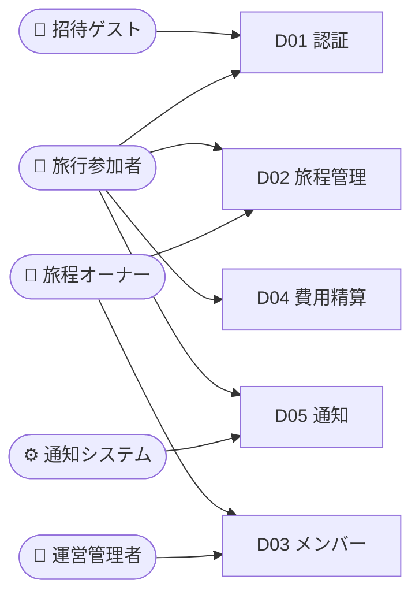

---

D01 認証 — メール・パスワード認証、招待リンク認証

旅行参加者と招待ゲストがサービスを利用開始するための入口。通常のメール・パスワード認証に加え、旅程オーナーが発行する招待リンク（トークン）経由でゲストがその場で参加できる軽量フローを持つ。セッションは JWT、トークンは1回限り有効。

### ユースケース図

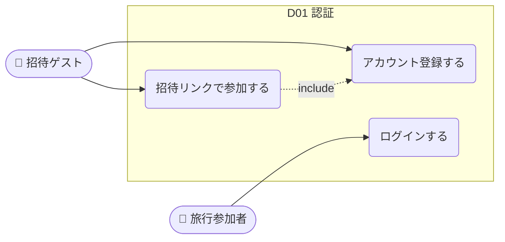

### フロー

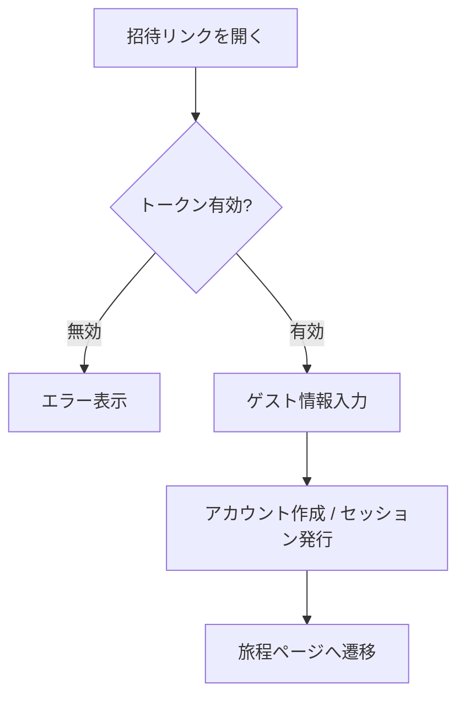

### アクティビティ（ユースケース）→ API → 画面

| # | UC ID | ユースケース | アクター | メソッド | エンドポイント | 画面パス | 画面名 | 状態 |
|---|---|---|---|---|---|---|---|---|
| 1 | UC-D01-01 | アカウント登録する | 招待ゲスト | POST | `/auth/signup` | `/signup` | 新規登録 | 実装済 |
| 2 | UC-D01-02 | ログインする | 旅行参加者 | POST | `/auth/login` | `/login` | ログイン | 実装済 |
| 3 | UC-D01-03 | 招待リンクで参加する | 招待ゲスト | POST | `/auth/invite/accept` | `/invite/:token` | 招待受諾 | 実装済 |

### キーポイント
- 招待トークンは1回限り有効・72時間で失効。受諾時に内部でアカウント登録（UC-D01-01）を include する。

D02 旅程管理 — 旅程・日程・立ち寄りスポットの作成と共有

旅行のコアとなる旅程データを扱う。オーナーが旅程の器を作り、参加者全員が立ち寄りスポットや日程を共同編集できる。変更はリアルタイムにメンバーへ反映される。

### ユースケース図

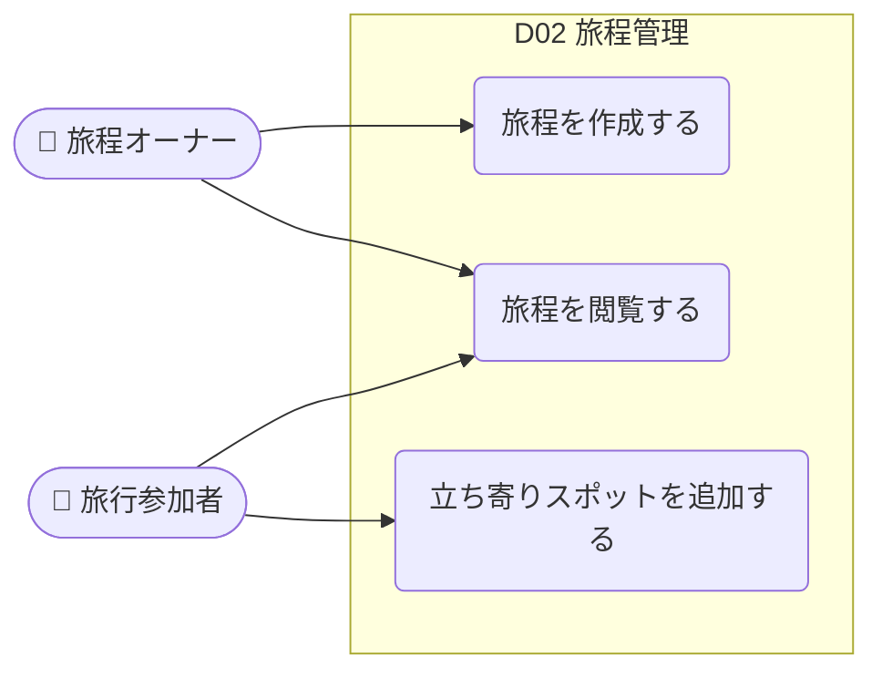

### フロー

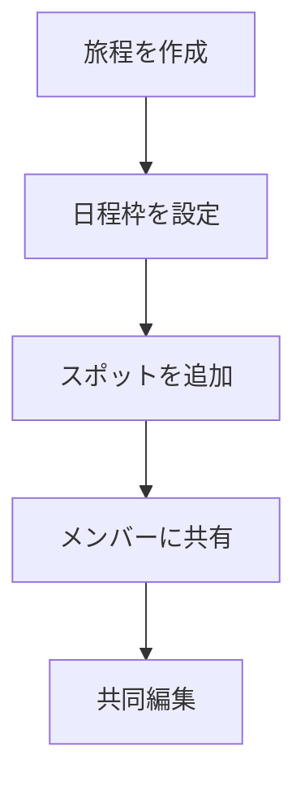

### アクティビティ（ユースケース）→ API → 画面

| # | UC ID | ユースケース | アクター | メソッド | エンドポイント | 画面パス | 画面名 | 状態 |
|---|---|---|---|---|---|---|---|---|
| 1 | UC-D02-01 | 旅程を作成する | 旅程オーナー | POST | `/trips` | `/trips/new` | 旅程作成 | 実装済 |
| 2 | UC-D02-02 | 旅程を閲覧する | 旅行参加者 | GET | `/trips/:id` | `/trips/:id` | 旅程詳細 | 実装済 |
| 3 | UC-D02-03 | 立ち寄りスポットを追加する | 旅行参加者 | POST | `/trips/:id/spots` | `/trips/:id` | 旅程詳細 | 実装済 |

### キーポイント
- 旅程作成者が自動的にオーナー権限を持つ。スポット追加は参加者全員が可能。

D03 メンバー — メンバー招待・権限管理

旅程ごとのメンバー構成と権限を管理する。オーナーは招待・権限変更ができ、運営管理者は不正アカウントの停止を行う。

### ユースケース図

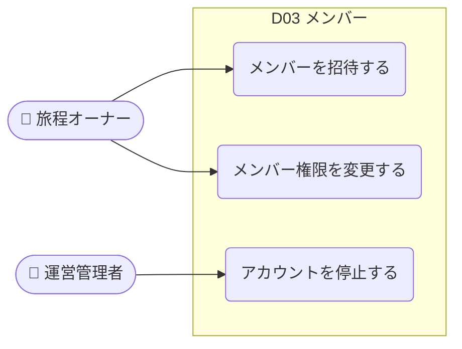

### フロー

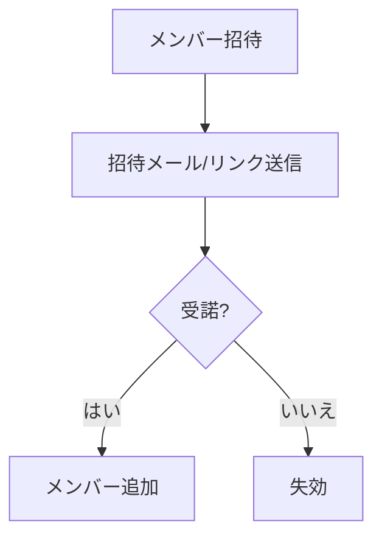

### アクティビティ（ユースケース）→ API → 画面

| # | UC ID | ユースケース | アクター | メソッド | エンドポイント | 画面パス | 画面名 | 状態 |
|---|---|---|---|---|---|---|---|---|
| 1 | UC-D03-01 | メンバーを招待する | 旅程オーナー | POST | `/trips/:id/invitations` | `/trips/:id/members` | メンバー管理 | 実装済 |
| 2 | UC-D03-02 | メンバー権限を変更する | 旅程オーナー | PATCH | `/trips/:id/members/:uid` | `/trips/:id/members` | メンバー管理 | 実装済 |
| 3 | UC-ADM-01 | アカウントを停止する | 運営管理者 | POST | `/admin/users/:uid/suspend` | `/admin/users` | ユーザー管理 | 実装済 |

### キーポイント
- 権限は viewer / editor / owner の3段階。owner は1旅程に複数設定可能。

D04 費用精算 — 立替の記録と割り勘の自動精算

旅行中の立替費用を記録し、メンバー間の貸し借りを最小回数の送金で精算する割り勘エンジンを提供する。

### ユースケース図

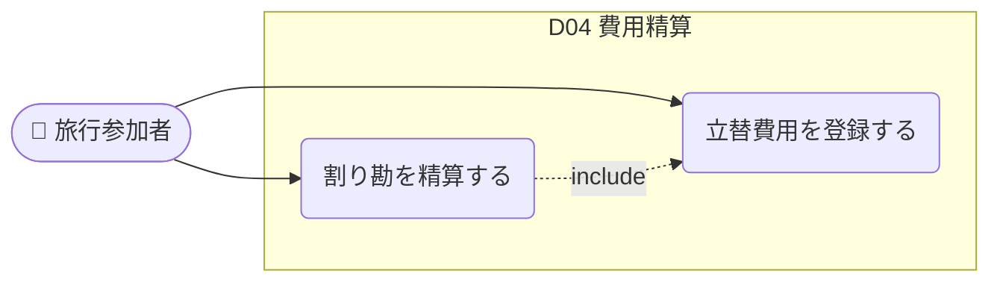

### フロー

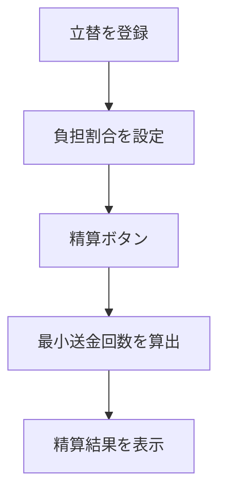

### アクティビティ（ユースケース）→ API → 画面

| # | UC ID | ユースケース | アクター | メソッド | エンドポイント | 画面パス | 画面名 | 状態 |
|---|---|---|---|---|---|---|---|---|
| 1 | UC-D04-01 | 立替費用を登録する | 旅行参加者 | POST | `/trips/:id/expenses` | `/trips/:id/expenses` | 費用一覧 | 実装済 |
| 2 | UC-D04-02 | 割り勘を精算する | 旅行参加者 | POST | `/trips/:id/settlements` | `/trips/:id/expenses` | 費用一覧 | 実装済 |

### キーポイント
- 精算アルゴリズムは送金回数を最小化（グリーディ）。通貨は旅程ごとに固定。

D05 通知 — 出発前リマインドと更新通知

旅程の更新や出発前のリマインドをメンバーに届ける。ユーザーは通知種別ごとにオン/オフを設定できる。リマインドは通知システム（バッチ）が自動送信する。

### ユースケース図

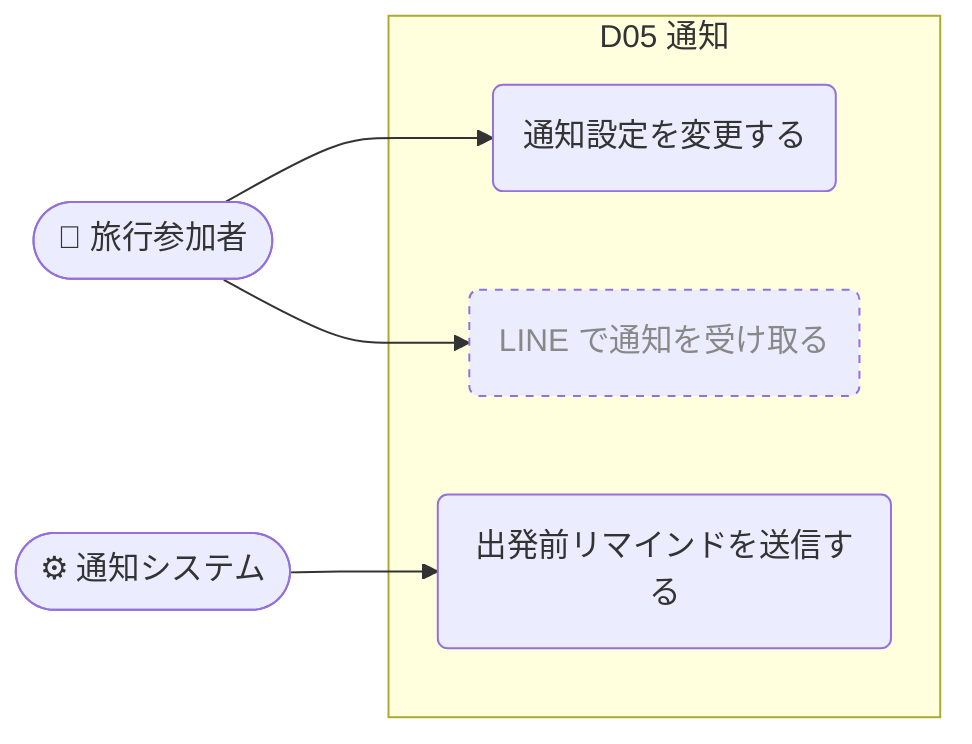

> 破線ノード（UC-D05-03）は仕様書にあるが**未実装**のユースケース。

### フロー

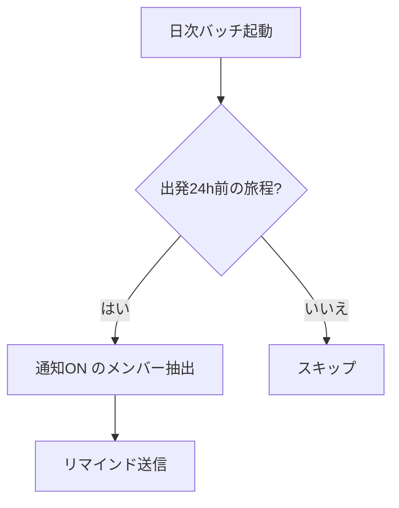

### アクティビティ（ユースケース）→ API → 画面

| # | UC ID | ユースケース | アクター | メソッド | エンドポイント | 画面パス | 画面名 | 状態 |
|---|---|---|---|---|---|---|---|---|
| 1 | UC-D05-01 | 通知設定を変更する | 旅行参加者 | PATCH | `/me/notifications` | `/settings/notifications` | 通知設定 | 実装済 |
| 2 | UC-D05-02 | 出発前リマインドを送信する | 通知システム | — | （バッチ）`worker/remind` | — | — | 実装済 |
| 3 | UC-D05-03 | LINE で通知を受け取る | 旅行参加者 | — | — | — | — | 未実装 |

### キーポイント
- リマインドは出発24時間前に1回。通知OFFのメンバーは対象外。
- UC-D05-03（LINE 通知）は仕様書 §7.2 に記載があるが未実装。API・画面は実装が無いため空欄。

